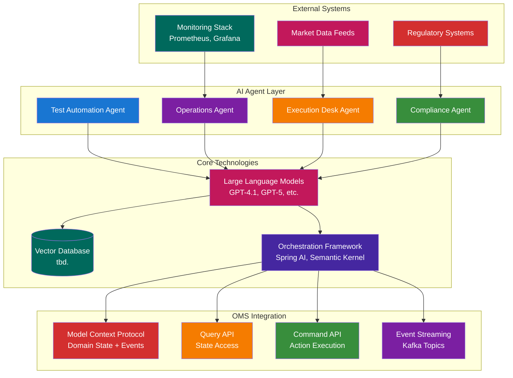
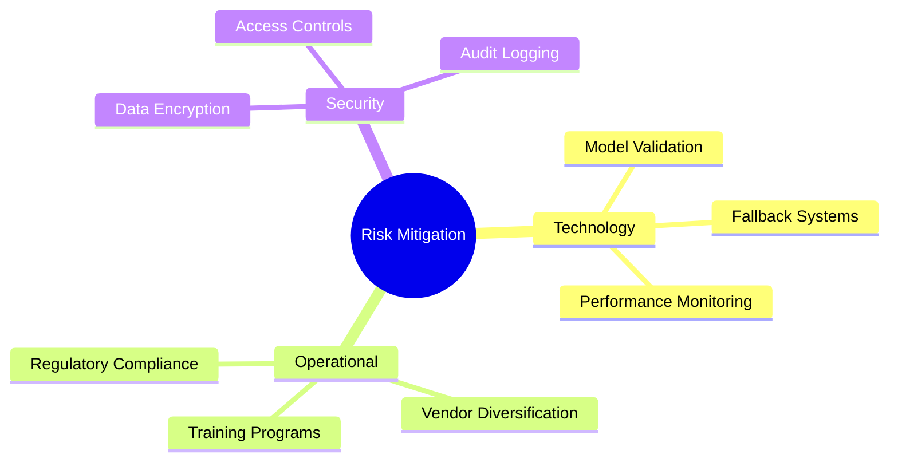
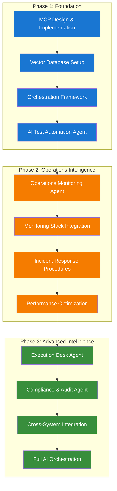

# OMS Future Considerations and Technology Direction

**Executive Summary:** This document outlines strategic directions for integrating Agentic AI and advanced technologies into the Order Management System (OMS). It prioritizes use cases by impact and feasibility, providing a roadmap for AI-powered automation, intelligent operations, and enhanced decision support.

---

## Table of Contents

- [OMS Future Considerations and Technology Direction](#oms-future-considerations-and-technology-direction)
  - [Table of Contents](#table-of-contents)
  - [AI Integration Architecture Overview](#ai-integration-architecture-overview)
  - [I. Core Concepts and Technologies](#i-core-concepts-and-technologies)
  - [IV. Risk Assessment](#iv-risk-assessment)
    - [Technology Risks](#technology-risks)
    - [Operational Risks](#operational-risks)
    - [Security Risks](#security-risks)
    - [Mitigation Strategies](#mitigation-strategies)
  - [V. Success Metrics and KPIs](#v-success-metrics-and-kpis)
    - [Quantitative Metrics](#quantitative-metrics)
    - [Qualitative Metrics](#qualitative-metrics)
    - [Business Impact Metrics](#business-impact-metrics)
  - [VI. Implementation Roadmap](#vi-implementation-roadmap)
    - [Strategic Implementation Approach](#strategic-implementation-approach)
    - [Key Success Factors](#key-success-factors)
  - [VII. Next Steps and Action Items](#vii-next-steps-and-action-items)
    - [Immediate Actions (Next 30 Days)](#immediate-actions-next-30-days)
    - [Short-term Goals (Next 90 Days)](#short-term-goals-next-90-days)
    - [Medium-term Objectives (Next 6 Months)](#medium-term-objectives-next-6-months)
    - [Resource Requirements](#resource-requirements)

---

## AI Integration Architecture Overview



---

## I. Core Concepts and Technologies

Before diving into specific use cases, let's establish some key concepts:

*   **Agentic AI:** Instead of just *using* AI models passively, agentic AI involves creating autonomous "agents" that can perceive their environment, make decisions, take actions, and learn over time. These agents can interact with the OMS, other systems, and even human users. Think of them as intelligent assistants that can automate tasks, solve problems, and provide insights.
*   **Model Context Protocol (MCP):** MCP is a critical enabler. It provides a standardized way for AI models (and agents) to access and understand the context they need to make informed decisions. For OMS, this context includes:
    *   Domain Object State: Current state of orders, executions, etc.
    *   Event History: The sequence of events that have affected a domain object.
    *   Business Rules: Validation rules, state transition rules, routing rules, etc.
    *   Market Data: Real-time market information.
    *   Execution Desk Preferences: Configuration and rules set by the execution desk.
*   **Key Technologies/Frameworks:**
    *   **LLMs (Large Language Models):** For natural language processing, understanding complex instructions, and generating human-readable explanations.
    *   **Vector Databases:** To store and efficiently retrieve embeddings of domain object states, events, and rules for semantic search and context retrieval.
    *   **Orchestration Frameworks:** Tools like Spring AI, Semantic Kernel, or custom-built orchestrators to manage the flow of information and actions between agents, models, and the OMS.
    *   **Decision Support Systems:** Augment the workflow of agentic AI to allow human in the loop decision making, oversight and validation

**II. Prioritized Use Cases and Exploration Areas**

Here are some use cases, ranked by potential impact and feasibility, along with specific suggestions:

1.  **AI-Powered End-to-End Test Automation and Regression (High Impact, Medium Complexity):**

    ### Test Automation Flow

    ```mermaid
    flowchart TD
        A[Test Case Generation] --> B[Test Data Creation]
        B --> C[Test Execution]
        C --> D[Result Analysis]
        D --> E{Test Passed?}
        E -->|Yes| F[Log Success]
        E -->|No| G[Generate Failure Report]
        G --> H[Update Test Cases]
        H --> I[Schedule Regression]
        I --> C

        A --> J[API Schema Analysis]
        A --> K[Domain State Query]
        A --> L[Historical Failure Analysis]

        style A fill:#1976d2,color:#ffffff
        style C fill:#f57c00,color:#ffffff
        style D fill:#388e3c,color:#ffffff
        style G fill:#d32f2f,color:#ffffff
    ```

    *   **Concept:** Create AI agents that can automatically generate test cases, execute tests, and analyze results.
    *   **How it Works:**
        *   **Test Case Generation:** The AI agent uses the OpenAPI and Avro schemas to understand the API contracts. It accesses domain object states (using the Query API) to generate realistic test data. It can also analyze past test failures to generate tests that specifically target known weaknesses.
        *   **Test Execution:** The agent uses the Command API to execute test scenarios and observes the resulting events.
        *   **Result Analysis:** The agent analyzes the events to determine if the tests passed or failed. It can use LLMs to generate human-readable explanations of test failures.
        *   **Regression Testing:**  The AI agent can automatically re-run tests whenever the code changes to ensure that new code doesn't break existing functionality.
    *   **Worth Exploring:**
        *   Using LLMs to generate test cases from natural language descriptions of requirements.
        *   Generating synthetic data to simulate trading scenarios and augment traditional testing

2.  **AI-Powered Operations and Problem Analysis (High Impact, Medium Complexity):**

    ### Operations Monitoring Flow

    ```mermaid
    flowchart TD
        A[Monitor Metrics] --> B{Analyze Patterns}
        B --> C{Anomaly Detected?}
        C -->|No| A
        C -->|Yes| D[Root Cause Analysis]
        D --> E[Access Event Logs]
        E --> F[Query Domain States]
        F --> G[Generate Hypotheses]
        G --> H{Remediation Possible?}
        H -->|Yes| I[Auto-Remediate]
        H -->|No| J[Generate Alert]
        J --> K[Notify Operations Team]
        I --> L[Log Resolution]
        K --> M[Human Intervention]

        style A fill:#1976d2,color:#ffffff
        style D fill:#f57c00,color:#ffffff
        style I fill:#388e3c,color:#ffffff
        style J fill:#d32f2f,color:#ffffff
    ```

    *   **Concept:** Use AI agents to monitor the OMS, detect anomalies, and diagnose problems.
    *   **How it Works:**
        *   **Anomaly Detection:** The AI agent monitors key metrics (e.g., order processing latency, execution rates, error rates) and uses machine learning models to detect unusual patterns.
        *   **Root Cause Analysis:** When an anomaly is detected, the AI agent uses MCP to access event logs, domain object states, and system logs to identify the root cause of the problem. It can use LLMs to generate hypotheses about the cause of the problem and test those hypotheses by querying the OMS.
        *   **Automated Remediation:** In some cases, the AI agent can automatically remediate problems (e.g., restarting a failed service, scaling up resources).
    *   **Worth Exploring:**
        *   Integrating with existing monitoring tools (e.g., Prometheus, Grafana).
        *   Using LLMs to generate alerts and notifications that are tailored to the specific problem.
        *   Creating a "chatbot" interface that allows operations engineers to interact with the AI agent and ask questions about the system.

3.  **Intelligent Execution Desk Assistance (Medium Impact, High Complexity):**

    ### Execution Desk Workflow

    ```mermaid
    flowchart TD
        A[Receive Order] --> B[Analyze Order Characteristics]
        B --> C[Query Market Data]
        C --> D[Check Desk Preferences]
        D --> E[Generate Routing Recommendation]
        E --> F[Present to Execution Desk]
        F --> G{Accept Recommendation?}
        G -->|Yes| H[Execute Routing]
        G -->|No| I[Manual Override]
        H --> J[Monitor Execution]
        I --> J
        J --> K{Anomalies Detected?}
        K -->|Yes| L[Alert Execution Desk]
        K -->|No| M[Continue Monitoring]

        style A fill:#1976d2,color:#ffffff
        style E fill:#f57c00,color:#ffffff
        style H fill:#388e3c,color:#ffffff
        style L fill:#d32f2f,color:#ffffff
    ```

    *   **Concept:** Provide AI agents that can assist the execution desk with their daily tasks.
    *   **How it Works:**
        *   **Order Routing Optimization:** The AI agent can analyze market data, order characteristics, and execution desk preferences to recommend the optimal routing strategy for orders.
        *   **Exception Handling:** The AI agent can identify and prioritize orders that require manual intervention (e.g., orders that have failed validation, orders that are stuck in a particular state).
        *   **Market Anomaly Detection:** The AI agent can analyze market data in real-time and alert the execution desk to potential anomalies (e.g., flash crashes, unexpected price movements).
    *   **Worth Exploring:**
        *   Integrating with the Execution Desk UI to provide real-time recommendations and alerts.
 

4.  **AI-Powered Compliance and Auditability (Medium Impact, Medium Complexity):**

    *   **Concept:** Automate compliance checks and improve auditability using AI.
    *   **How it Works:**
        *   **Rule Enforcement Monitoring:** AI agents monitor order and execution data to ensure compliance with regulatory rules and internal policies. MCP provides the agents with the relevant rule definitions.
        *   **Audit Trail Analysis:** LLMs can analyze event logs to generate human-readable audit trails, explaining the sequence of events leading to a particular outcome.
    *   **Worth Exploring:**
        *   Integrating with regulatory reporting systems.

**III. Implementation Considerations**

*   **Explainability and Transparency:** AI agents' decisions need to be transparent and explainable, especially with regards to regulations.
*   **Model Context Protocol Implementation:** Design a robust and efficient mechanism for providing AI agents with access to the information they need. This might involve:
    *   A knowledge graph that represents the relationships between different entities in the OMS.
    *   Embedding domain object states and events in a vector database for semantic search.

---

## IV. Risk Assessment

### Technology Risks
- **Model Hallucinations:** AI agents may generate incorrect or misleading information
- **Integration Complexity:** Challenges in connecting AI agents with existing OMS infrastructure
- **Performance Impact:** AI processing may introduce latency in critical trading operations

### Operational Risks
- **Skill Gap:** Team may lack expertise in AI/ML technologies
- **Vendor Dependency:** Reliance on external AI providers and their service availability
- **Regulatory Compliance:** Ensuring AI decisions meet regulatory requirements

### Security Risks
- **Data Privacy:** Protecting sensitive trading data used by AI models
- **Model Poisoning:** Potential for adversarial attacks on AI systems
- **Access Control:** Managing permissions for AI agents accessing OMS data

### Mitigation Strategies


---

## V. Success Metrics and KPIs

### Quantitative Metrics
- **Test Automation Coverage:** Percentage of test cases generated by AI (Target: 80%)
- **Anomaly Detection Accuracy:** True positive rate for problem identification (Target: 95%)
- **Response Time Improvement:** Reduction in mean time to resolution (Target: 40% faster)
- **Compliance Violation Reduction:** Decrease in regulatory breaches (Target: 50% reduction)

### Qualitative Metrics
- **User Satisfaction:** Execution desk feedback on AI assistance quality
- **System Reliability:** Reduction in false positives from AI monitoring
- **Knowledge Transfer:** Team's ability to understand and maintain AI systems

### Business Impact Metrics
- **Cost Reduction:** Operational cost savings from automation
- **Revenue Impact:** Improved execution quality leading to better pricing
- **Risk Reduction:** Lower operational risk exposure

---

## VI. Implementation Roadmap



### Strategic Implementation Approach

**Foundation Phase (3-6 months):**
- Establish core AI infrastructure and protocols
- Deploy initial AI-powered test automation
- Build foundational capabilities and validate approach

**Operations Intelligence Phase (6-12 months):**
- Expand AI capabilities to operational monitoring
- Integrate with existing systems and workflows
- Optimize performance and establish best practices

**Advanced Intelligence Phase (12-18 months):**
- Deploy sophisticated AI agents for complex tasks
- Achieve full integration across all OMS functions
- Realize comprehensive AI-driven automation

### Key Success Factors
- **Incremental Approach:** Start small, prove value, then expand
- **Cross-functional Collaboration:** Involve all stakeholders early
- **Continuous Learning:** Regularly assess and adapt based on results
- **Risk Management:** Implement safeguards and fallback procedures

---

## VII. Next Steps and Action Items

### Immediate Actions (Next 30 Days)
- [ ] **Form AI Task Force:** Assemble cross-functional team including developers, operations, and business stakeholders
- [ ] **Technology Assessment:** Evaluate and select AI frameworks, vector databases, and orchestration tools
- [ ] **Pilot Project Planning:** Define scope and success criteria for test automation pilot
- [ ] **Stakeholder Alignment:** Present roadmap to executive team and secure buy-in

### Short-term Goals (Next 90 Days)
- [ ] **MCP Proof of Concept:** Build working prototype of Model Context Protocol
- [ ] **Data Preparation:** Prepare and clean historical data for AI model training
- [ ] **Security Review:** Conduct security assessment of AI integration approach
- [ ] **Training Program:** Develop training materials for team AI skill development

### Medium-term Objectives (Next 6 Months)
- [ ] **Test Automation Deployment:** Roll out AI-powered test automation in production
- [ ] **Operations Agent Launch:** Deploy AI monitoring and problem analysis capabilities
- [ ] **Performance Benchmarking:** Establish baseline metrics and monitoring
- [ ] **Feedback Integration:** Implement feedback loops for continuous AI improvement

### Resource Requirements
- **Team:** 2-3 AI/ML engineers, 1 data scientist, 2 backend developers
- **Infrastructure:** GPU resources for model training, vector database cluster
- **Budget:** $500K-$750K for initial implementation and tooling
- **Timeline:** 12-18 months for full AI integration

---

*Document Version: 1.0 | Last Updated: September 14, 2025 | Next Review: Q1 2026*
