# Order Grouping Specification

**Version:** 1.0  
**Last Updated:** October 8, 2025  
**Author:** Trading Systems Team  
**Status:** Draft

---

## 1. Introduction

This specification defines the order grouping capability for the Order Management System (OMS), enabling the execution desk to consolidate multiple individual client orders for the same security and price into a single grouped order for market placement.

### 1.1 Purpose

- Enable fair price allocation across multiple client orders
- Improve execution efficiency through order aggregation
- Support portfolio rebalancing workflows from external asset managers
- Ensure accurate allocation of executions from grouped orders back to individual client orders

### 1.2 Business Context

External asset managers often perform portfolio rebalances that affect multiple client portfolios simultaneously, generating many small individual orders for the same security. The execution desk needs to:

1. **Consolidate** individual client orders into a single grouped order
2. **Execute** the grouped order in the market as one large order
3. **Allocate** fills from the grouped order back to individual client orders
4. **Ensure** fair price distribution across all participants

**Example Scenario:**
```
Asset Manager XYZ rebalances 50 client portfolios
→ Generates 50 individual orders: BUY 100 shares AAPL @ $150.00 each
→ Execution desk groups into: BUY 5,000 shares AAPL @ $150.00
→ Market execution: Filled @ average price $149.95
→ All 50 client orders allocated at $149.95 (fair pricing)
```

---

## 2. Architecture Overview

### 2.1 Order Hierarchy

The grouping capability extends the existing order tree structure:

```
Root Order (Grouped Order)
    ├── Client Order 1 (Member)
    ├── Client Order 2 (Member)
    ├── Client Order 3 (Member)
    └── ...
    └── Client Order N (Member)
         └── Market Order (Child of Grouped Order)
```

**Key Relationships:**
- **Grouped Order**: Virtual parent order representing the consolidated size
- **Member Orders**: Individual client orders participating in the group
- **Market Order**: Child order of the grouped order sent to execution venues

---

### 2.2 Visual Representation

```mermaid
graph TB
    subgraph GroupedOrder["🎯 Grouped Order: GRP-001"]
        G["Type: GROUPED<br/>─────────────────<br/>Symbol: AAPL<br/>Side: BUY<br/>Price: 150.00<br/>─────────────────<br/>OrderQty: 5,000<br/>CumQty: 5,000<br/>LeavesQty: 0<br/>AvgPx: 149.95<br/>─────────────────<br/>MemberCount: 3<br/>AllocatedQty: 5,000"]
    end
    
    subgraph Members["👥 Member Orders (Client Orders)"]
        C1["CLIENT-001<br/>─────────────────<br/>Account: ClientA<br/>OrderQty: 2,000<br/>CumQty: 2,000<br/>AvgPx: 149.95<br/>groupOrderId: GRP-001"]
        C2["CLIENT-002<br/>─────────────────<br/>Account: ClientB<br/>OrderQty: 2,000<br/>CumQty: 2,000<br/>AvgPx: 149.95<br/>groupOrderId: GRP-001"]
        C3["CLIENT-003<br/>─────────────────<br/>Account: ClientC<br/>OrderQty: 1,000<br/>CumQty: 1,000<br/>AvgPx: 149.95<br/>groupOrderId: GRP-001"]
    end
    
    subgraph MarketOrder["🏪 Market Order"]
        M["MKT-001<br/>─────────────────<br/>OrderQty: 5,000<br/>CumQty: 5,000<br/>AllocatedQty: 5,000<br/>AvgPx: 149.95<br/>parentOrderId: GRP-001"]
    end
    
    GroupedOrder --> C1
    GroupedOrder --> C2
    GroupedOrder --> C3
    GroupedOrder --> MarketOrder
    
    style GroupedOrder fill:#e1f5ff,stroke:#0366d6,stroke-width:3px
    style Members fill:#fff3cd,stroke:#ffc107,stroke-width:2px
    style MarketOrder fill:#d4edda,stroke:#28a745,stroke-width:2px
```



---

## 3. Data Model Enhancements

### 3.1 Order Entity Changes

Add the following fields to the existing `Order` entity:

```java
@Entity
@Table(name = "orders")
public class Order {
    
    // ... existing fields ...
    
    // ==================== GROUPING FIELDS ====================
    
    /**
     * Identifies the grouped order this order belongs to (for member orders).
     * NULL for non-grouped orders.
     * Self-referential for grouped orders (groupOrderId == orderId).
     */
    @Column(name = "group_order_id")
    private String groupOrderId;
    
    /**
     * Indicates if this order is a grouped order.
     * TRUE: This order represents a group of member orders
     * FALSE/NULL: Regular order (client or market order)
     */
    @Column(name = "is_grouped_order", nullable = false)
    @Builder.Default
    private Boolean isGroupedOrder = false;
    
    /**
     * Number of member orders in this group (for grouped orders only).
     * NULL for non-grouped orders.
     */
    @Column(name = "member_count")
    private Integer memberCount;
    
    /**
     * Timestamp when the grouping was created.
     * NULL for non-grouped orders.
     */
    @Column(name = "grouped_at")
    private LocalDateTime groupedAt;
    
    /**
     * User/system that created the group.
     * NULL for non-grouped orders.
     */
    @Column(name = "grouped_by")
    private String groupedBy;
    
    /**
     * Total quantity allocated from grouped order back to members.
     * Used to track allocation progress.
     */
    @Column(name = "allocated_to_members_qty")
    @Builder.Default
    private BigDecimal allocatedToMembersQty = BigDecimal.ZERO;
    
    // ... existing fields ...
}
```

---

### 3.2 Database Schema Changes

```sql
-- Add grouping columns to orders table
ALTER TABLE orders 
    ADD COLUMN group_order_id VARCHAR(255),
    ADD COLUMN is_grouped_order BOOLEAN NOT NULL DEFAULT FALSE,
    ADD COLUMN member_count INTEGER,
    ADD COLUMN grouped_at TIMESTAMP,
    ADD COLUMN grouped_by VARCHAR(255),
    ADD COLUMN allocated_to_members_qty NUMERIC(19,4) DEFAULT 0;

-- Add index for efficient group member lookups
CREATE INDEX idx_orders_group_order_id ON orders(group_order_id) 
    WHERE group_order_id IS NOT NULL;

-- Add index for grouped order queries
CREATE INDEX idx_orders_is_grouped ON orders(is_grouped_order) 
    WHERE is_grouped_order = TRUE;
```

---

### 3.3 Order Type Enumeration

Extend existing order classification (optional, for clarity):

```java
public enum OrderRole {
    CLIENT,        // Individual client order
    MARKET,        // Market order sent to venue
    GROUPED,       // Grouped/consolidated order
    MEMBER         // Client order that is part of a group
}
```

**Usage:**
```java
@Enumerated(EnumType.STRING)
@Column(name = "order_role")
private OrderRole orderRole;
```

---

## 4. Grouping Workflow

### 4.1 Group Creation Process

```mermaid
sequenceDiagram
    participant Desk as 👤 Execution Desk
    participant API as 🔌 OMS API
    participant Service as ⚙️ Grouping Service
    participant Validator as ✅ Validator
    participant Repo as 💾 Repository
    
    Desk->>API: POST /api/commands/orders/group<br/>{memberOrderIds: [C1, C2, C3]}
    API->>Service: createGroupedOrder(memberOrderIds)
    
    Service->>Validator: validateGroupEligibility()
    Note over Validator: Check:<br/>✓ Same symbol<br/>✓ Same side<br/>✓ Same price<br/>✓ Same order type<br/>✓ All NEW state<br/>✓ Not already grouped
    
    alt Validation Failed
        Validator-->>Service: ValidationException
        Service-->>API: Error Response
        API-->>Desk: 400 Bad Request
    else Validation Passed
        Validator-->>Service: ✓ OK
        
        Service->>Service: calculateGroupedQty()
        Note over Service: SUM(member.orderQty)
        
        Service->>Service: createGroupedOrder()
        Note over Service: orderId: GRP-XXX<br/>isGroupedOrder: true<br/>groupOrderId: self-ref<br/>orderQty: total
        
        Service->>Service: updateMemberOrders()
        Note over Service: Set groupOrderId<br/>on all members
        
        Service->>Repo: saveAll(grouped, members)
        Repo-->>Service: Persisted
        
        Service->>Service: emitGroupedEvent()
        
        Service-->>API: GroupedOrderDto
        API-->>Desk: 201 Created
    end
```



---

### 4.2 Group Eligibility Rules

**Validation Criteria:**

| Rule | Description | Validation Logic |
|------|-------------|------------------|
| **Same Security** | All orders must be for the same symbol | `symbol` field equality |
| **Same Side** | All orders must be BUY or SELL | `side` field equality |
| **Same Price** | All limit orders must have same limit price | `price` field equality (or all MARKET) |
| **Same Order Type** | All must be LIMIT or all MARKET | `ordType` field equality |
| **NEW State** | All orders must be in NEW state | `state == State.NEW` |
| **Not Grouped** | Orders cannot already be in a group | `groupOrderId == NULL` |
| **Same Account Type** | Optional: Same institutional account type | Configurable rule |

**Java Validation Example:**

```java
public class GroupingValidator {
    
    public void validateGroupEligibility(List<Order> members) {
        if (members == null || members.size() < 2) {
            throw new ValidationException("At least 2 orders required for grouping");
        }
        
        Order reference = members.get(0);
        
        // Check all orders match reference criteria
        for (Order order : members) {
            if (!Objects.equals(order.getSymbol(), reference.getSymbol())) {
                throw new ValidationException(
                    "All orders must have the same symbol. Found: " + 
                    order.getSymbol() + " vs " + reference.getSymbol()
                );
            }
            
            if (order.getSide() != reference.getSide()) {
                throw new ValidationException(
                    "All orders must have the same side. Found: " + 
                    order.getSide() + " vs " + reference.getSide()
                );
            }
            
            if (!Objects.equals(order.getPrice(), reference.getPrice())) {
                throw new ValidationException(
                    "All orders must have the same price. Found: " + 
                    order.getPrice() + " vs " + reference.getPrice()
                );
            }
            
            if (order.getOrdType() != reference.getOrdType()) {
                throw new ValidationException(
                    "All orders must have the same order type"
                );
            }
            
            if (order.getState() != State.NEW) {
                throw new ValidationException(
                    "All orders must be in NEW state. Order " + 
                    order.getOrderId() + " is in state " + order.getState()
                );
            }
            
            if (order.getGroupOrderId() != null) {
                throw new ValidationException(
                    "Order " + order.getOrderId() + 
                    " is already part of group " + order.getGroupOrderId()
                );
            }
        }
    }
}
```

---

## 5. Allocation Workflow

### 5.1 Grouped Order Execution and Allocation

```mermaid
sequenceDiagram
    participant Market as 🏪 Market
    participant MO as 📋 Market Order<br/>MKT-001
    participant GO as 🎯 Grouped Order<br/>GRP-001
    participant Alloc as 📊 Allocation Service
    participant Members as 👥 Member Orders<br/>[C1, C2, C3]
    
    Market->>MO: EXECUTION-1<br/>LastQty: 5,000<br/>LastPx: 149.95
    
    MO->>MO: Update Quantities
    Note over MO: CumQty: 5,000<br/>AvgPx: 149.95<br/>FILLED
    
    MO->>GO: Propagate to Parent (Grouped Order)
    Note over GO: CumQty: 5,000<br/>AvgPx: 149.95
    
    GO->>Alloc: allocateToMembers()
    
    Alloc->>Alloc: Calculate Pro-Rata Shares
    Note over Alloc: C1: 2,000/5,000 = 40%<br/>C2: 2,000/5,000 = 40%<br/>C3: 1,000/5,000 = 20%
    
    Alloc->>Members: Allocate Executions
    Note over Members: C1: Qty=2,000, Px=149.95<br/>C2: Qty=2,000, Px=149.95<br/>C3: Qty=1,000, Px=149.95
    
    Members->>Members: Update State
    Note over Members: CumQty updated<br/>AvgPx = 149.95<br/>FILLED
    
    Alloc->>GO: Update Allocation Tracking
    Note over GO: allocatedToMembersQty: 5,000
    
    Alloc-->>GO: ✅ Allocation Complete
```



---

### 5.2 Pro-Rata Allocation Algorithm

**Principle:** Allocate executions proportionally based on each member's original order quantity.

**Formula:**
```
memberAllocation = (memberOrderQty / groupedOrderQty) × executionQty
```

**Java Implementation:**

```java
public class GroupedOrderAllocationService {
    
    public void allocateToMembers(Order groupedOrder, Execution execution) {
        if (!groupedOrder.getIsGroupedOrder()) {
            throw new IllegalArgumentException("Order is not a grouped order");
        }
        
        // Fetch all member orders
        List<Order> members = orderRepository.findByGroupOrderId(
            groupedOrder.getOrderId()
        );
        
        BigDecimal totalGroupQty = groupedOrder.getOrderQty();
        BigDecimal executionQty = execution.getLastQty();
        BigDecimal executionPx = execution.getLastPx();
        
        BigDecimal totalAllocated = BigDecimal.ZERO;
        
        // Sort members for deterministic allocation (handle rounding)
        members.sort(Comparator.comparing(Order::getOrderId));
        
        for (int i = 0; i < members.size(); i++) {
            Order member = members.get(i);
            BigDecimal memberQty;
            
            if (i == members.size() - 1) {
                // Last member gets remainder to avoid rounding errors
                memberQty = executionQty.subtract(totalAllocated);
            } else {
                // Pro-rata calculation
                BigDecimal ratio = member.getOrderQty()
                    .divide(totalGroupQty, 10, RoundingMode.HALF_UP);
                memberQty = executionQty.multiply(ratio)
                    .setScale(0, RoundingMode.DOWN); // Whole shares
            }
            
            // Update member order
            allocateToMember(member, memberQty, executionPx);
            totalAllocated = totalAllocated.add(memberQty);
        }
        
        // Update grouped order allocation tracking
        groupedOrder.setAllocatedToMembersQty(
            groupedOrder.getAllocatedToMembersQty().add(executionQty)
        );
        orderRepository.save(groupedOrder);
    }
    
    private void allocateToMember(Order member, BigDecimal qty, BigDecimal px) {
        // Update cumQty
        BigDecimal newCumQty = member.getCumQty().add(qty);
        
        // Update avgPx (weighted average)
        BigDecimal previousNotional = member.getCumQty()
            .multiply(member.getAvgPx() != null ? member.getAvgPx() : BigDecimal.ZERO);
        BigDecimal newNotional = qty.multiply(px);
        BigDecimal totalNotional = previousNotional.add(newNotional);
        BigDecimal newAvgPx = totalNotional.divide(newCumQty, 4, RoundingMode.HALF_UP);
        
        // Update leavesQty
        BigDecimal newLeavesQty = member.getOrderQty().subtract(newCumQty);
        
        // Update state
        State newState = newLeavesQty.compareTo(BigDecimal.ZERO) == 0 
            ? State.FILLED 
            : State.PARTIALLY_FILLED;
        
        // Create updated order (immutable pattern)
        Order updated = member.toBuilder()
            .cumQty(newCumQty)
            .avgPx(newAvgPx)
            .leavesQty(newLeavesQty)
            .state(newState)
            .build();
        
        orderRepository.save(updated);
        
        // Emit allocation event
        emitMemberAllocationEvent(updated, qty, px);
    }
}
```

---

### 5.3 Partial Fill Allocation

**Scenario:** Grouped order partially filled

```mermaid
graph TB
    subgraph State1["Initial State"]
        G1["Grouped Order<br/>OrderQty: 5,000<br/>CumQty: 0"]
        C1_1["Member C1<br/>OrderQty: 2,000<br/>CumQty: 0"]
        C2_1["Member C2<br/>OrderQty: 2,000<br/>CumQty: 0"]
        C3_1["Member C3<br/>OrderQty: 1,000<br/>CumQty: 0"]
    end
    
    subgraph State2["After Partial Fill: 3,000 shares"]
        G2["Grouped Order<br/>OrderQty: 5,000<br/>CumQty: 3,000<br/>LeavesQty: 2,000"]
        C1_2["Member C1<br/>OrderQty: 2,000<br/>CumQty: 1,200<br/>LeavesQty: 800<br/>⚡ PARTIALLY_FILLED"]
        C2_2["Member C2<br/>OrderQty: 2,000<br/>CumQty: 1,200<br/>LeavesQty: 800<br/>⚡ PARTIALLY_FILLED"]
        C3_2["Member C3<br/>OrderQty: 1,000<br/>CumQty: 600<br/>LeavesQty: 400<br/>⚡ PARTIALLY_FILLED"]
    end
    
    State1 -->|Execution: 3,000 @ $149.95| State2
    
    style State1 fill:#fff3cd,stroke:#ffc107,stroke-width:2px
    style State2 fill:#d4edda,stroke:#28a745,stroke-width:2px
```



**Allocation Calculation:**
```
Total Execution: 3,000 shares

Pro-Rata Allocation:
  C1: (2,000 / 5,000) × 3,000 = 1,200 shares
  C2: (2,000 / 5,000) × 3,000 = 1,200 shares
  C3: (1,000 / 5,000) × 3,000 = 600 shares
  
Total: 1,200 + 1,200 + 600 = 3,000 ✓
```

---

## 6. Quantity Calculations

### 6.1 Grouped Order Quantities

| Field | Calculation | Description |
|-------|-------------|-------------|
| `orderQty` | `Σ(memberOrder.orderQty)` | Sum of all member order quantities |
| `cumQty` | From market order executions | Total executed quantity |
| `leavesQty` | `orderQty - cumQty` | Remaining open quantity |
| `avgPx` | From market order executions | Average execution price |
| `allocatedToMembersQty` | `Σ(allocated to members)` | Total allocated back to members |

**Validation Invariants:**
```java
// Grouped order quantity must equal sum of members
assert groupedOrder.orderQty.equals(
    members.stream()
        .map(Order::getOrderQty)
        .reduce(BigDecimal.ZERO, BigDecimal::add)
);

// Allocated quantity must not exceed executed quantity
assert groupedOrder.allocatedToMembersQty
    .compareTo(groupedOrder.cumQty) <= 0;
```

---

### 6.2 Member Order Quantities

| Field | Update Timing | Source |
|-------|---------------|--------|
| `orderQty` | At creation | Original client order quantity |
| `cumQty` | After allocation | Pro-rata share of group executions |
| `leavesQty` | After allocation | `orderQty - cumQty` |
| `avgPx` | After allocation | Inherited from grouped order avg price |

---

## 7. State Transitions

### 7.1 Grouped Order State Machine


---

### 7.2 Member Order State Synchronization

**Rule:** Member order states reflect their allocation status, not the grouped order state.


---

## 8. API Endpoints

### 8.1 Create Grouped Order

**Endpoint:**
```
POST /api/commands/orders/group
```

**Request Body:**
```json
{
  "memberOrderIds": [
    "CLIENT-001",
    "CLIENT-002",
    "CLIENT-003"
  ],
  "groupedBy": "trader123",
  "description": "Portfolio rebalance for Asset Manager XYZ"
}
```

**Response (201 Created):**
```json
{
  "groupedOrderId": "GRP-789",
  "memberCount": 3,
  "totalQuantity": 5000,
  "symbol": "AAPL",
  "side": "BUY",
  "price": 150.00,
  "orderType": "LIMIT",
  "groupedAt": "2025-10-08T14:30:00Z",
  "state": "NEW",
  "members": [
    {
      "orderId": "CLIENT-001",
      "account": "ClientA",
      "quantity": 2000
    },
    {
      "orderId": "CLIENT-002",
      "account": "ClientB",
      "quantity": 2000
    },
    {
      "orderId": "CLIENT-003",
      "account": "ClientC",
      "quantity": 1000
    }
  ]
}
```

---

### 8.2 Query Grouped Orders

**Endpoint:**
```
GET /api/query/orders?isGroupedOrder=true
```

**Response:**
```json
{
  "content": [
    {
      "orderId": "GRP-789",
      "symbol": "AAPL",
      "side": "BUY",
      "orderQty": 5000,
      "cumQty": 5000,
      "avgPx": 149.95,
      "state": "FILLED",
      "memberCount": 3,
      "allocatedToMembersQty": 5000,
      "groupedAt": "2025-10-08T14:30:00Z"
    }
  ],
  "pageable": { ... },
  "totalElements": 1
}
```

---

### 8.3 Query Group Members

**Endpoint:**
```
GET /api/query/orders?groupOrderId=GRP-789
```

**Response:**
```json
{
  "content": [
    {
      "orderId": "CLIENT-001",
      "groupOrderId": "GRP-789",
      "account": "ClientA",
      "orderQty": 2000,
      "cumQty": 2000,
      "avgPx": 149.95,
      "state": "FILLED"
    },
    {
      "orderId": "CLIENT-002",
      "groupOrderId": "GRP-789",
      "account": "ClientB",
      "orderQty": 2000,
      "cumQty": 2000,
      "avgPx": 149.95,
      "state": "FILLED"
    },
    {
      "orderId": "CLIENT-003",
      "groupOrderId": "GRP-789",
      "account": "ClientC",
      "orderQty": 1000,
      "cumQty": 1000,
      "avgPx": 149.95,
      "state": "FILLED"
    }
  ],
  "totalElements": 3
}
```

---

### 8.4 Ungroup Orders (Optional)

**Endpoint:**
```
POST /api/commands/orders/{groupedOrderId}/ungroup
```

**Conditions:**
- Only allowed if `state == NEW`
- No market orders placed yet
- No executions received

**Response (200 OK):**
```json
{
  "message": "Group GRP-789 successfully ungrouped",
  "ungroupedOrderIds": ["CLIENT-001", "CLIENT-002", "CLIENT-003"]
}
```

---

## 9. Edge Cases & Business Rules

### 9.1 Rounding and Fractional Shares

**Problem:** Pro-rata allocation may result in fractional shares.

**Solution:**
1. Round down to whole shares for all but last member
2. Allocate remainder to last member to ensure total accuracy

**Example:**
```
Execution: 1,000 shares
Members:
  C1: 333 shares (33.3%)
  C2: 333 shares (33.3%)
  C3: 334 shares (33.4% + remainder)
  
Total: 1,000 ✓
```

---

### 9.2 Grouped Order Cancellation

**Scenario:** Cancel a grouped order before full execution.

**Behavior:**
1. Cancel market order (if placed)
2. Update grouped order state to `CANCELLED`
3. Update member orders:
   - Filled portion remains `FILLED` or `PARTIALLY_FILLED`
   - Unfilled portion becomes `CANCELLED`


---

### 9.3 Member Order Modification

**Rule:** Individual member orders **cannot be modified** once grouped.

**Rationale:**
- Modifications would desynchronize group quantities
- Would require re-validation of grouping criteria
- Complexity in allocation logic

**Alternative:** Ungroup, modify, then re-group.

---

### 9.4 Grouped Order with Diverse Accounts

**Validation:** Ensure regulatory compliance when grouping orders across different accounts.

**Additional Fields:**
```java
@Column(name = "cross_account_approved")
private Boolean crossAccountApproved;

@Column(name = "compliance_check_id")
private String complianceCheckId;
```

---

## 10. Execution Desk UI Considerations

### 10.1 Trade Blotter View

**Grouped Order Display:**

| Order ID | Type | Symbol | Side | Qty | Status | Members | Action |
|----------|------|--------|------|-----|--------|---------|--------|
| GRP-789 | 🎯 GROUP | AAPL | BUY | 5,000 | FILLED | 3 | [View Details] |

**Expanded View:**

```
┌─ Grouped Order: GRP-789 ──────────────────────────────────────────┐
│ Symbol: AAPL          Side: BUY          Price: $150.00            │
│ Total Qty: 5,000      Filled: 5,000     Avg Px: $149.95           │
│ State: FILLED         Members: 3        Allocated: 5,000           │
├───────────────────────────────────────────────────────────────────┤
│ Member Orders:                                                     │
│  ✓ CLIENT-001  ClientA    2,000 @ $149.95  FILLED                │
│  ✓ CLIENT-002  ClientB    2,000 @ $149.95  FILLED                │
│  ✓ CLIENT-003  ClientC    1,000 @ $149.95  FILLED                │
└───────────────────────────────────────────────────────────────────┘
```

---

### 10.2 Grouping Workflow UI

```mermaid
graph LR
    A[Select Orders] --> B{Validate<br/>Eligibility}
    B -->|✓ Valid| C[Preview Group]
    B -->|✗ Invalid| A
    C --> D[Confirm Group]
    D --> E[Create Grouped Order]
    E --> F[Place Market Order]
    F --> G[Monitor Execution]
    G --> H[Allocate to Members]
    
    style A fill:#e1f5ff
    style C fill:#fff3cd
    style E fill:#d4edda
    style H fill:#d4edda
```



---

## 11. Reporting & Analytics

### 11.1 Grouping Metrics

**Daily Grouping Report:**

| Metric | Value |
|--------|-------|
| Total Grouped Orders | 15 |
| Total Member Orders | 237 |
| Total Grouped Quantity | 1,250,000 shares |
| Avg Group Size | 15.8 members |
| Avg Price Improvement | $0.03 per share |

---

### 11.2 Fair Allocation Audit

**Allocation Accuracy Report:**

```sql
SELECT 
    go.order_id AS grouped_order_id,
    go.symbol,
    go.avg_px AS group_avg_price,
    COUNT(mo.id) AS member_count,
    SUM(mo.order_qty) AS total_member_qty,
    go.order_qty AS grouped_order_qty,
    SUM(mo.cum_qty) AS total_allocated_qty,
    go.allocated_to_members_qty,
    -- Check for allocation discrepancies
    ABS(SUM(mo.cum_qty) - go.allocated_to_members_qty) AS allocation_variance
FROM orders go
LEFT JOIN orders mo ON mo.group_order_id = go.order_id
WHERE go.is_grouped_order = true
GROUP BY go.order_id, go.symbol, go.avg_px, go.order_qty, go.allocated_to_members_qty
HAVING ABS(SUM(mo.cum_qty) - go.allocated_to_members_qty) > 0.01;
```

---

## 12. Testing Scenarios

### 12.1 Test Case 1: Simple Grouping and Full Fill

```
Given:
  Client Order 1: BUY 1,000 AAPL @ $150.00, State=NEW
  Client Order 2: BUY 1,500 AAPL @ $150.00, State=NEW
  
When:
  Create grouped order with [C1, C2]
  
Then:
  Grouped Order: OrderQty = 2,500, State = NEW
  Member Orders: groupOrderId set to grouped order ID
  
When:
  Market order placed and filled: 2,500 @ $149.95
  
Then:
  Grouped Order: CumQty = 2,500, AvgPx = $149.95, State = FILLED
  Client Order 1: CumQty = 1,000, AvgPx = $149.95, State = FILLED
  Client Order 2: CumQty = 1,500, AvgPx = $149.95, State = FILLED
  Total Allocated: 2,500 ✓
```

---

### 12.2 Test Case 2: Partial Fill with Rounding

```
Given:
  Grouped Order: 3 members with quantities [1,000, 1,000, 1,000] = 3,000 total
  
When:
  Execution received: 1,000 shares @ $100.00
  
Then:
  Pro-rata allocation (33.33% each):
    Member 1: 333 shares (rounded down)
    Member 2: 333 shares (rounded down)
    Member 3: 334 shares (remainder)
  
  Total allocated: 333 + 333 + 334 = 1,000 ✓
  All members: State = PARTIALLY_FILLED
```

---

### 12.3 Test Case 3: Validation Failure - Mixed Symbols

```
Given:
  Client Order 1: BUY 1,000 AAPL @ $150.00
  Client Order 2: BUY 1,000 MSFT @ $300.00
  
When:
  Attempt to create grouped order
  
Then:
  ValidationException: "All orders must have the same symbol. Found: MSFT vs AAPL"
  No grouped order created
```

---

### 12.4 Test Case 4: Grouped Order Cancellation

```
Given:
  Grouped Order: 3 members, 5,000 total quantity
  Market Order: Placed, partially filled 2,000 shares
  Allocated to members: 2,000 shares pro-rata
  
When:
  Cancel grouped order
  
Then:
  Market Order: Cancelled
  Grouped Order: State = CANCELLED, CumQty = 2,000 (locked)
  Member Orders: 
    - Allocated portion: State = PARTIALLY_FILLED (locked)
    - Unallocated portion: State = CANCELLED
```

---

## 13. Integration with Existing Order Tree

### 13.1 Combined Hierarchy

Grouped orders coexist with the traditional parent-child order structure:

```
Grouped Order (GRP-001)
    ├── Member: Client Order 1
    ├── Member: Client Order 2
    └── Member: Client Order 3
         └── Market Order (child of Grouped Order)
              └── Execution(s)
```

**Key Differences:**

| Aspect | Traditional Tree | Grouped Order |
|--------|------------------|---------------|
| Relationship | `parentOrderId` | `groupOrderId` |
| Hierarchy | Parent → Child (1:N) | Group → Members (1:N) |
| Quantity Flow | Top-down placement | Lateral aggregation, then allocation |
| Allocation | Direct parent-child | Pro-rata to members |

---

### 13.2 Query Optimization

**Index Strategy:**

```sql
-- Efficient member lookup
CREATE INDEX idx_orders_group_order_id 
ON orders(group_order_id) 
WHERE group_order_id IS NOT NULL;

-- Grouped order filter
CREATE INDEX idx_orders_is_grouped 
ON orders(is_grouped_order) 
WHERE is_grouped_order = TRUE;

-- Combined grouping + state queries
CREATE INDEX idx_orders_grouped_state 
ON orders(is_grouped_order, state) 
WHERE is_grouped_order = TRUE;
```

---

## 14. Event Schema

### 14.1 Grouped Order Created Event

```json
{
  "eventType": "GROUPED_ORDER_CREATED",
  "timestamp": "2025-10-08T14:30:00Z",
  "groupedOrderId": "GRP-789",
  "memberOrderIds": ["CLIENT-001", "CLIENT-002", "CLIENT-003"],
  "symbol": "AAPL",
  "side": "BUY",
  "price": 150.00,
  "totalQuantity": 5000,
  "memberCount": 3,
  "groupedBy": "trader123"
}
```

---

### 14.2 Member Allocation Event

```json
{
  "eventType": "MEMBER_ALLOCATED",
  "timestamp": "2025-10-08T15:45:00Z",
  "groupedOrderId": "GRP-789",
  "memberOrderId": "CLIENT-001",
  "allocatedQuantity": 2000,
  "allocationPrice": 149.95,
  "cumulativeQuantity": 2000,
  "leavesQuantity": 0,
  "memberState": "FILLED"
}
```

---

## 15. Configuration

### 15.1 Grouping Rules Configuration

```yaml
oms:
  grouping:
    enabled: true
    min-members: 2
    max-members: 100
    require-same-account-type: false
    require-compliance-approval: true
    allocation-mode: PRO_RATA  # or FIFO, MANUAL
    rounding-strategy: LAST_MEMBER_REMAINDER
```

---

## 16. Security & Compliance

### 16.1 Access Control

**Permissions:**
- `orders:group:create` - Create grouped orders
- `orders:group:view` - View grouped orders and members
- `orders:group:ungroup` - Ungroup orders (if in NEW state)
- `orders:group:allocate` - Manual allocation override

---

### 16.2 Audit Trail

**Required Audit Events:**
- Grouped order creation (who, when, member list)
- Member additions/removals (if supported)
- Allocation decisions (quantities, prices)
- Ungrouping actions
- Compliance approval timestamps

---

## 17. Future Enhancements

### 17.1 Dynamic Member Addition

Support adding new member orders to an existing group (before market placement).

```
POST /api/commands/orders/{groupedOrderId}/add-members
{
  "memberOrderIds": ["CLIENT-004", "CLIENT-005"]
}
```

---

### 17.2 Multi-Leg Grouped Orders

Support grouping across multiple securities (basket orders).

```
Grouped Basket Order:
  ├── Member: BUY 1,000 AAPL @ $150.00
  ├── Member: BUY 500 MSFT @ $300.00
  └── Member: BUY 2,000 GOOGL @ $120.00
```

---

### 17.3 AI-Powered Grouping Suggestions

Automatically suggest grouping candidates based on:
- Order arrival patterns
- Historical execution quality
- Market conditions

---

## 18. References

- **`oms_spec.md`**: Core OMS architecture and domain model
- **`order_tree_calculations.md`**: Order tree hierarchy and quantity calculations
- **`state-query-store_spec.md`**: Event sourcing and state management
- **FIX Protocol 4.4/5.0**: Order quantity field semantics (Tag 38, 14, 151, 6)

---

## 19. Revision History

| Version | Date | Author | Changes |
|---------|------|--------|---------|
| 1.0 | 2025-10-08 | Trading Systems Team | Initial specification for order grouping capability |

---

## Appendix A: Complete Data Model Summary

### A.1 Order Entity Fields

```java
@Entity
@Table(name = "orders")
public class Order {
    
    // ==================== EXISTING FIELDS ====================
    @Id
    private Long id;
    private String orderId;
    private String parentOrderId;          // Traditional tree hierarchy
    private String rootOrderId;            // Traditional tree root
    
    // Order attributes
    private String symbol;
    private Side side;
    private BigDecimal price;
    private OrdType ordType;
    private BigDecimal orderQty;
    private BigDecimal cumQty;
    private BigDecimal leavesQty;
    private BigDecimal avgPx;
    private State state;
    
    // ==================== GROUPING FIELDS (NEW) ====================
    private String groupOrderId;           // Links member to grouped order
    private Boolean isGroupedOrder;        // Identifies grouped orders
    private Integer memberCount;           // Count of member orders
    private LocalDateTime groupedAt;       // Grouping timestamp
    private String groupedBy;              // User who created group
    private BigDecimal allocatedToMembersQty; // Allocation tracking
    
    // ... other existing fields ...
}
```

---

## Appendix B: SQL Migration Script

```sql
-- Migration: Add Order Grouping Support
-- Version: 1.0
-- Date: 2025-10-08

BEGIN;

-- Add new columns
ALTER TABLE orders 
    ADD COLUMN group_order_id VARCHAR(255),
    ADD COLUMN is_grouped_order BOOLEAN NOT NULL DEFAULT FALSE,
    ADD COLUMN member_count INTEGER,
    ADD COLUMN grouped_at TIMESTAMP,
    ADD COLUMN grouped_by VARCHAR(255),
    ADD COLUMN allocated_to_members_qty NUMERIC(19,4) DEFAULT 0;

-- Create indexes for efficient queries
CREATE INDEX idx_orders_group_order_id 
    ON orders(group_order_id) 
    WHERE group_order_id IS NOT NULL;

CREATE INDEX idx_orders_is_grouped 
    ON orders(is_grouped_order) 
    WHERE is_grouped_order = TRUE;

CREATE INDEX idx_orders_grouped_state 
    ON orders(is_grouped_order, state) 
    WHERE is_grouped_order = TRUE;

-- Add comments for documentation
COMMENT ON COLUMN orders.group_order_id IS 
    'Identifies the grouped order this order belongs to (for member orders). Self-referential for grouped orders.';

COMMENT ON COLUMN orders.is_grouped_order IS 
    'TRUE if this order represents a group of member orders, FALSE for regular orders.';

COMMENT ON COLUMN orders.member_count IS 
    'Number of member orders in this group (for grouped orders only).';

COMMENT ON COLUMN orders.allocated_to_members_qty IS 
    'Total quantity allocated from this grouped order back to member orders.';

COMMIT;
```

---

**End of Specification**
