# Order Lifecycle Management: Replace, Cancel, and Reject Operations

## 1. Introduction

This specification defines the workflows and state management for order modification operations in the Order Management System (OMS). The OMS receives client orders from multiple sources including:

- In-house trading systems
- Online banking platforms
- Asset management systems
- Portfolio management systems
- External banks
- Institutional clients (via FIX protocol)

The OMS takes ownership of client orders by acknowledging receipt and successful validation. Orders are then placed in the market through:
- **Automated rules (STP - Straight Through Processing)**
- **Manual execution** by the execution desk

This document focuses on three critical order lifecycle operations:
1. **Replace** - Modifying order economics (price, quantity, instructions)
2. **Cancel** - Terminating an order
3. **Reject** - Declining an invalid or unacceptable order

All operations follow FIX protocol semantics and support rule-based propagation through the order tree (client/market order hierarchy).

## 2. Architecture Overview

### 2.1 Order Tree Structure

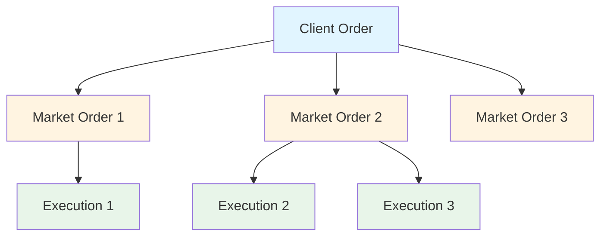

**Order Hierarchy:**
- **Client Order** - Original order from client
- **Market Order** - Order sent to broker/market (may be split or aggregated)
- **Execution** - Fill/partial fill confirmation

### 2.2 Event Propagation Rules

Events can propagate **upstream** (market → client) or **downstream** (client → market) based on configurable rules:

**Blocking Conditions:**
- Order is being worked by execution desk (manual intervention flag)
- Order is part of a grouped/parent order
- Order has specific routing instructions
- Market is closed or in pre-open/post-close
- Order in restricted state (pending approval, compliance hold)

## 3. Domain Model (FIX Protocol Semantics)

### 3.1 Order States

```java
public enum OrderState {
    NEW,                    // FIX: OrdStatus=0
    PARTIALLY_FILLED,       // FIX: OrdStatus=1
    FILLED,                 // FIX: OrdStatus=2
    DONE_FOR_DAY,          // FIX: OrdStatus=3
    CANCELED,              // FIX: OrdStatus=4
    PENDING_CANCEL,        // FIX: OrdStatus=6
    REJECTED,              // FIX: OrdStatus=8
    PENDING_NEW,           // FIX: OrdStatus=A
    PENDING_REPLACE,       // FIX: OrdStatus=E
    REPLACED,              // FIX: OrdStatus=5
    EXPIRED,               // FIX: OrdStatus=C
    SUSPENDED              // FIX: OrdStatus=9
}
```

### 3.2 Order Attributes

#### Core Attributes
```java
public class Order {
    // Identity
    private String orderId;              // Internal OMS ID
    private String clOrdID;              // FIX Tag 11 - Client Order ID
    private String origClOrdID;          // FIX Tag 41 - Original Client Order ID (for replace/cancel)
    
    // State Management
    private OrderState state;
    private OrderState pendingState;     // For replace workflow
    
    // Economics
    private BigDecimal orderQty;         // FIX Tag 38 - Current quantity
    private BigDecimal price;            // FIX Tag 44 - Current price
    private BigDecimal leavesQty;        // FIX Tag 151 - Remaining quantity
    private BigDecimal cumQty;           // FIX Tag 14 - Cumulative filled quantity
    
    // Pending Economics (for replace workflow)
    private BigDecimal pendingQty;       // Pending new quantity
    private BigDecimal pendingPrice;     // Pending new price
    private TimeInForce pendingTimeInForce;
    
    // FIX Fields
    private Side side;                   // FIX Tag 54 - Buy/Sell
    private OrdType ordType;             // FIX Tag 40 - Market/Limit/Stop etc.
    private TimeInForce timeInForce;     // FIX Tag 59 - DAY/GTC/IOC etc.
    private String symbol;               // FIX Tag 55
    private String execInst;             // FIX Tag 18 - Execution instructions
    
    // Workflow Control
    private boolean manualIntervention;  // Execution desk working flag
    private String groupId;              // Part of grouped order
    private boolean autoForward;         // Auto-forward to market flag
    
    // Relationships
    private String clientOrderId;        // Reference to client order (for market orders)
    private List<String> marketOrderIds; // Child market orders (for client orders)
    
    // Audit
    private Instant transactTime;        // FIX Tag 60
    private String text;                 // FIX Tag 58 - Free text
}
```

### 3.3 Cancel/Replace Reason Codes

```java
public enum CxlRejReason {
    TOO_LATE_TO_CANCEL(0),              // FIX Tag 102=0
    UNKNOWN_ORDER(1),                    // FIX Tag 102=1
    BROKER_EXCHANGE_OPTION(2),           // FIX Tag 102=2
    ORDER_ALREADY_PENDING_CANCEL_OR_REPLACE(3), // FIX Tag 102=3
    UNABLE_TO_PROCESS_ORDER_MASS_CANCEL(4),
    ORIG_ORD_MOD_TIME(5),
    DUPLICATE_CL_ORD_ID(6),
    INVALID_PRICE_INCREMENT(18),
    OTHER(99)
}

public enum CxlRejResponseTo {
    ORDER_CANCEL_REQUEST(1),             // FIX Tag 434=1
    ORDER_CANCEL_REPLACE_REQUEST(2)      // FIX Tag 434=2
}
```

## 4. Order Replace Workflow

### 4.1 Replace Request Flow

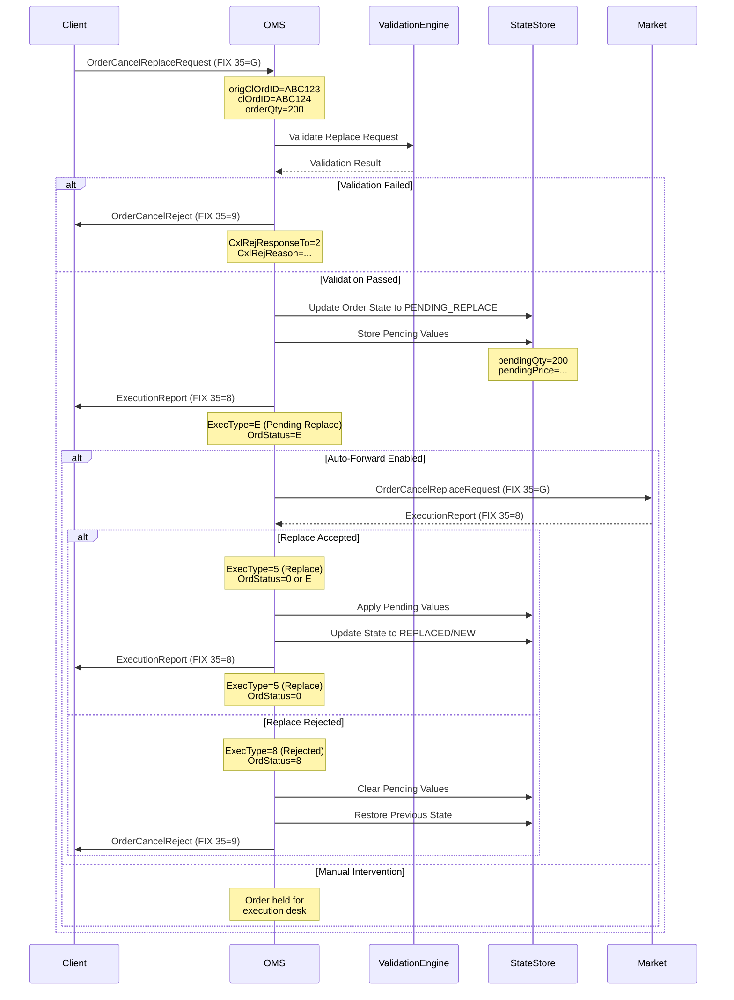

### 4.2 Replace State Transitions

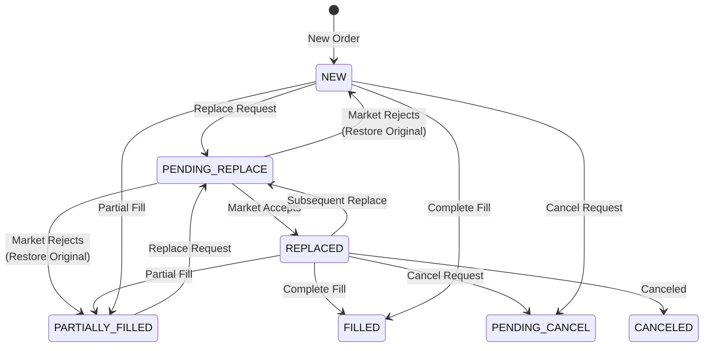

### 4.3 Replace Request Validation Rules

**Pre-validation Checks:**
1. Order exists in OMS
2. `origClOrdID` matches current `clOrdID`
3. Order not in terminal state (FILLED, CANCELED, REJECTED, EXPIRED)
4. Order not already in PENDING_REPLACE or PENDING_CANCEL
5. New `clOrdID` is unique

**Business Rules:**
1. Cannot reduce `orderQty` below `cumQty` (already filled quantity)
2. Price must be valid for `ordType` (e.g., LIMIT requires price)
3. Price must meet tick size requirements
4. Side cannot be changed (Buy/Sell)
5. Symbol cannot be changed
6. Replace must result in at least one field change

**Market-Specific Rules:**
1. Market must be open (unless specific instructions allow)
2. Security must be tradeable
3. Respect quantity limits (min/max order size)
4. Compliance checks (position limits, restricted list)

### 4.4 Pending Values Management

When a replace request moves to PENDING_REPLACE:

```java
public void applyPendingReplace(OrderCancelReplaceRequest request) {
    // Store pending values
    this.pendingState = OrderState.PENDING_REPLACE;
    this.pendingQty = request.getOrderQty();
    this.pendingPrice = request.getPrice();
    this.pendingTimeInForce = request.getTimeInForce();
    this.pendingExecInst = request.getExecInst();
    
    // Track replace chain
    this.origClOrdID = this.clOrdID;
    this.clOrdID = request.getClOrdID();
}

public void commitPendingReplace() {
    // Apply pending values to actual values
    if (this.pendingQty != null) {
        this.orderQty = this.pendingQty;
        this.leavesQty = this.orderQty.subtract(this.cumQty);
    }
    if (this.pendingPrice != null) {
        this.price = this.pendingPrice;
    }
    if (this.pendingTimeInForce != null) {
        this.timeInForce = this.pendingTimeInForce;
    }
    
    // Clear pending values
    clearPendingValues();
    
    // Update state
    this.state = OrderState.REPLACED;
}

public void rejectPendingReplace() {
    // Restore original clOrdID
    this.clOrdID = this.origClOrdID;
    this.origClOrdID = null;
    
    // Clear pending values
    clearPendingValues();
    
    // Restore previous state (NEW or PARTIALLY_FILLED)
    // State is NOT changed to REJECTED in this case
}
```

### 4.5 Replace Propagation Rules

**Client Order Replace → Market Order:**

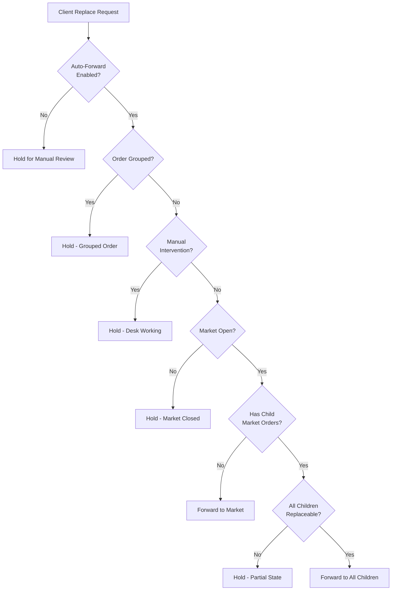

**Market Order Replace → Client Order:**

- Market replace accepted: Update client order automatically
- Market replace rejected: Notify client if original client replace
- Execution desk initiated replace: Do not propagate to client

## 5. Order Cancel Workflow

### 5.1 Cancel Request Flow

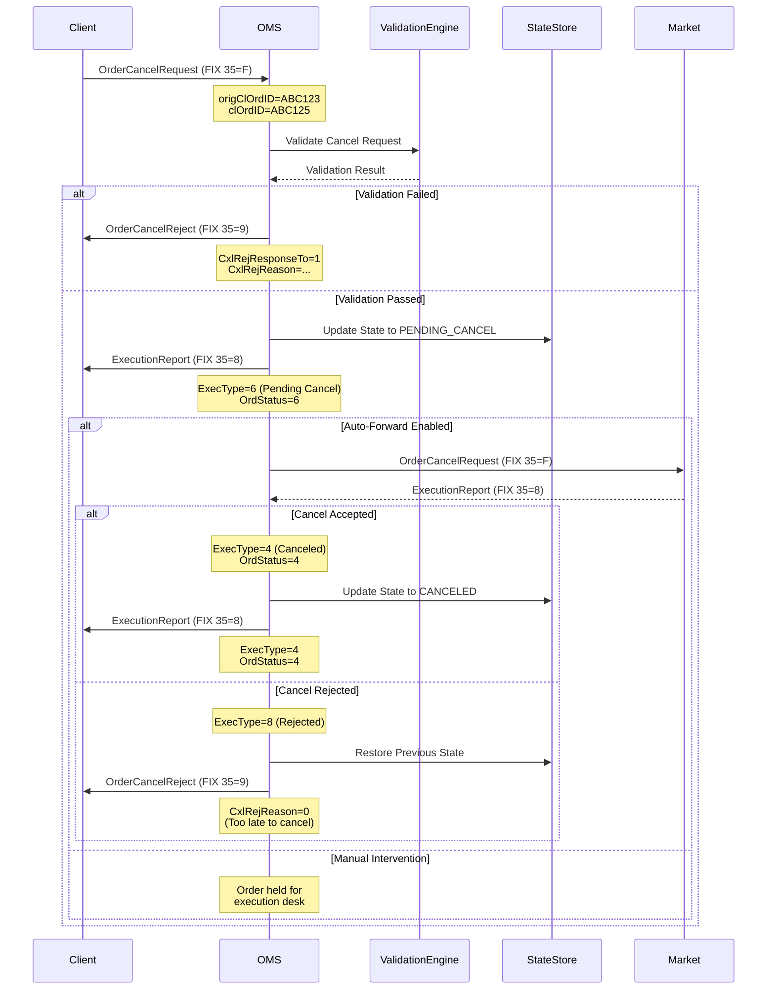

### 5.2 Cancel State Transitions

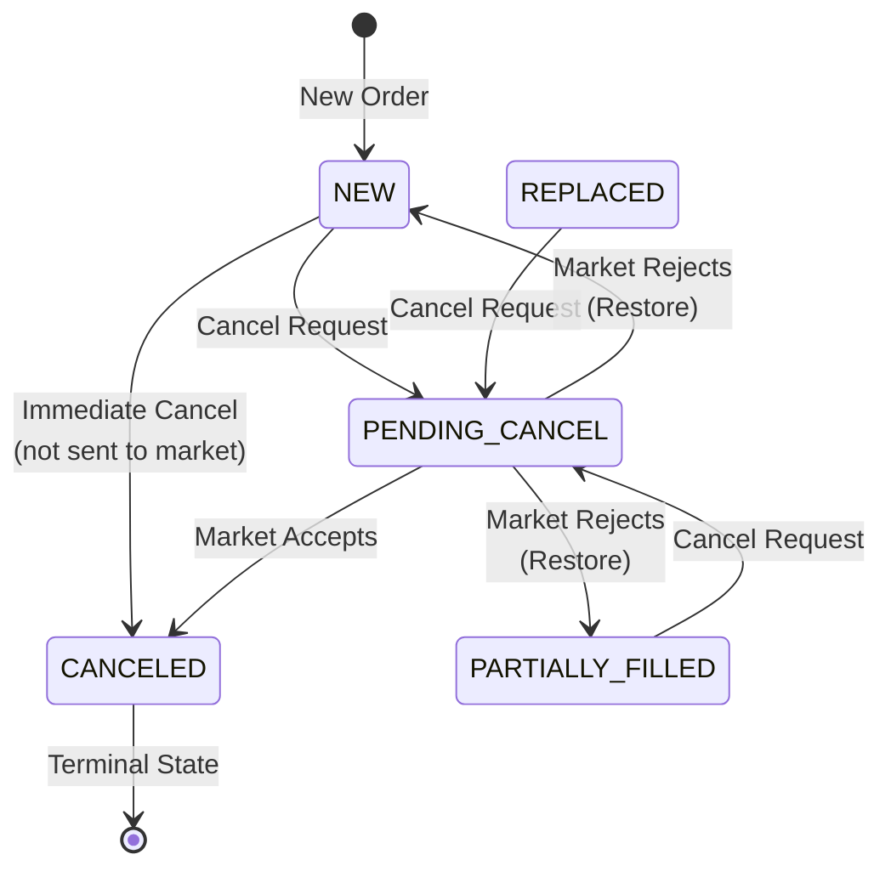

### 5.3 Cancel Request Validation Rules

**Pre-validation Checks:**
1. Order exists in OMS
2. `origClOrdID` matches current `clOrdID`
3. Order not in terminal state (FILLED, CANCELED, REJECTED, EXPIRED)
4. Order not already in PENDING_CANCEL
5. Order not in PENDING_REPLACE (must resolve replace first)

**Business Rules:**
1. Cannot cancel if `leavesQty = 0` (fully filled)
2. Cancel for partially filled order cancels remaining quantity
3. Grouped orders may require all-or-none cancel logic

**Market-Specific Rules:**
1. Market must be open (for most markets)
2. Order must be cancellable at current venue
3. Some markets don't support cancel (IOC already expired)

### 5.4 Cancel Propagation Rules

**Client Order Cancel → Market Order:**

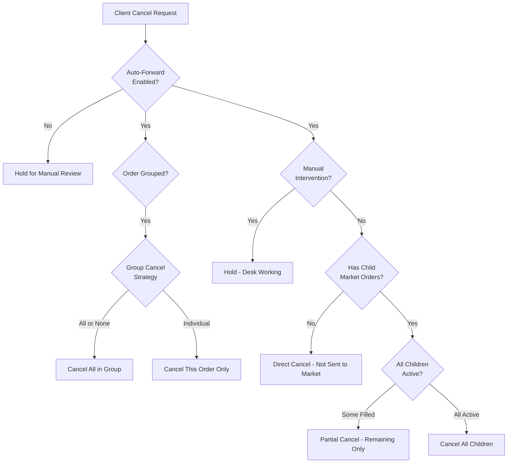

**Market Order Cancel → Client Order:**

- Market cancel accepted: Update client order (reduce `leavesQty`)
- Market cancel rejected: Restore client order state
- Unsolicited market cancel: Propagate to client automatically

### 5.5 Partial Cancel Scenarios

When a client order is split into multiple market orders:

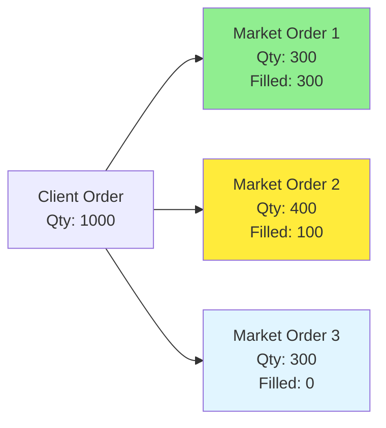

**Cancel Request Processing:**
1. Market Order 1: Fully filled - Cannot cancel
2. Market Order 2: Partially filled - Cancel remaining 300
3. Market Order 3: Not filled - Cancel entire 300

**Client Order Update:**
- Original `orderQty`: 1000
- `cumQty`: 400 (300 + 100)
- `leavesQty`: 600 → After cancel: 300 (if MO2 cancel rejected) or 0 (if all accepted)

## 6. Order Reject Workflow

### 6.1 Reject Sources and Scenarios

**OMS-Initiated Rejects:**
- Validation failures (invalid price, quantity)
- Compliance violations (restricted security, position limits)
- Duplicate order detection
- Market closed/not available
- Insufficient credit/buying power
- Symbol not supported

**Market-Initiated Rejects:**
- Invalid order parameters for venue
- Quantity below minimum or above maximum
- Price outside price bands
- Security halted/suspended
- Account restrictions
- Broker rejection

### 6.2 Reject Flow - OMS Validation Failure

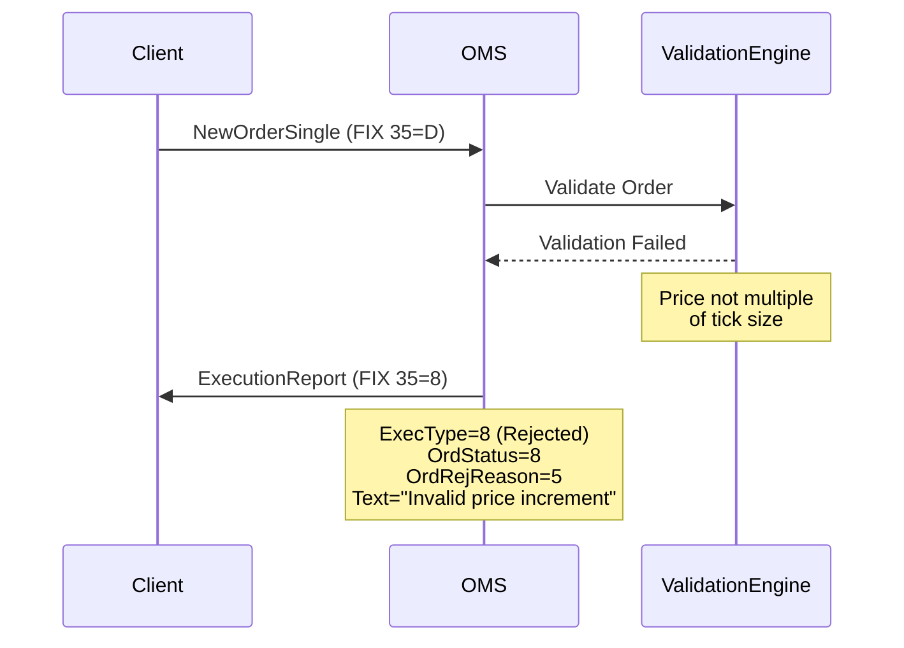

### 6.3 Reject Flow - Market Rejection

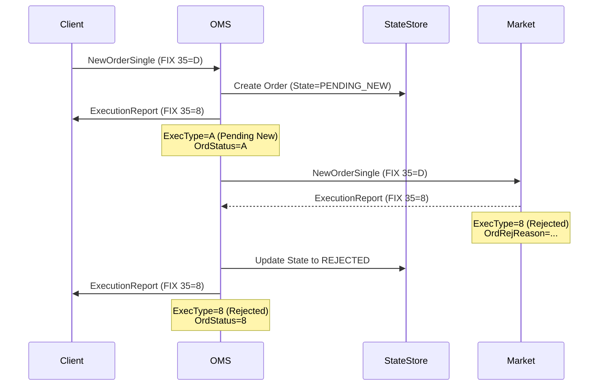

### 6.4 Reject Reason Codes (FIX OrdRejReason - Tag 103)

```java
public enum OrdRejReason {
    BROKER_EXCHANGE_OPTION(0),
    UNKNOWN_SYMBOL(1),
    EXCHANGE_CLOSED(2),
    ORDER_EXCEEDS_LIMIT(3),
    TOO_LATE_TO_ENTER(4),
    UNKNOWN_ORDER(5),
    DUPLICATE_ORDER(6),
    DUPLICATE_VERBAL_ORDER(7),
    STALE_ORDER(8),
    TRADE_ALONG_REQUIRED(9),
    INVALID_INVESTOR_ID(10),
    UNSUPPORTED_ORDER_CHARACTERISTIC(11),
    SURVEILLENCE_OPTION(12),
    INCORRECT_QUANTITY(13),
    INCORRECT_ALLOCATED_QUANTITY(14),
    UNKNOWN_ACCOUNT(15),
    PRICE_EXCEEDS_BAND(16),
    INVALID_PRICE_INCREMENT(18),
    OTHER(99)
}
```

### 6.5 Reject Propagation Rules

**Market Order Reject → Client Order:**

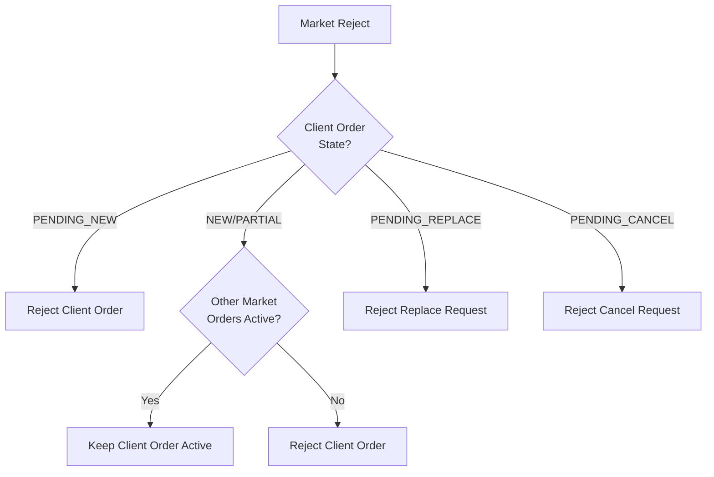

**Client Order Reject - Impact on Market Orders:**

- Client order rejected before market send: No market orders created
- Client order rejected after market send: Cancel all child market orders

## 7. Event Sourcing and State Management

### 7.1 Command Types

```java
// Replace Commands
public class OrderCancelReplaceRequestCommand {
    private String orderId;
    private String origClOrdID;
    private String clOrdID;
    private BigDecimal orderQty;
    private BigDecimal price;
    private TimeInForce timeInForce;
    private String execInst;
    private Instant transactTime;
}

// Cancel Commands
public class OrderCancelRequestCommand {
    private String orderId;
    private String origClOrdID;
    private String clOrdID;
    private Instant transactTime;
    private String text;
}

// Reject Commands
public class OrderRejectCommand {
    private String orderId;
    private OrdRejReason ordRejReason;
    private String text;
}
```

### 7.2 Event Types

```java
// Replace Events
public class OrderPendingReplaceEvent {
    private String orderId;
    private String origClOrdID;
    private String newClOrdID;
    private BigDecimal pendingQty;
    private BigDecimal pendingPrice;
    private Instant eventTime;
}

public class OrderReplacedEvent {
    private String orderId;
    private String clOrdID;
    private BigDecimal oldQty;
    private BigDecimal newQty;
    private BigDecimal oldPrice;
    private BigDecimal newPrice;
    private Instant eventTime;
}

public class OrderReplaceRejectedEvent {
    private String orderId;
    private String clOrdID;
    private CxlRejReason cxlRejReason;
    private String text;
    private Instant eventTime;
}

// Cancel Events
public class OrderPendingCancelEvent {
    private String orderId;
    private String clOrdID;
    private BigDecimal leavesQty;
    private Instant eventTime;
}

public class OrderCanceledEvent {
    private String orderId;
    private String clOrdID;
    private BigDecimal leavesQty;
    private BigDecimal cumQty;
    private Instant eventTime;
}

public class OrderCancelRejectedEvent {
    private String orderId;
    private String clOrdID;
    private CxlRejReason cxlRejReason;
    private String text;
    private Instant eventTime;
}

// Reject Events
public class OrderRejectedEvent {
    private String orderId;
    private String clOrdID;
    private OrdRejReason ordRejReason;
    private String text;
    private Instant eventTime;
}
```

### 7.3 Event Storage Schema

```sql
CREATE TABLE order_events (
    event_id UUID PRIMARY KEY,
    order_id VARCHAR(50) NOT NULL,
    cl_ord_id VARCHAR(50),
    event_type VARCHAR(100) NOT NULL,
    event_data JSONB NOT NULL,
    event_time TIMESTAMP NOT NULL,
    sequence_number BIGINT NOT NULL,
    
    INDEX idx_order_id (order_id),
    INDEX idx_event_time (event_time),
    INDEX idx_event_type (event_type)
);

-- Order state view (materialized)
CREATE TABLE orders (
    order_id VARCHAR(50) PRIMARY KEY,
    cl_ord_id VARCHAR(50) NOT NULL,
    orig_cl_ord_id VARCHAR(50),
    
    -- Current state
    state VARCHAR(30) NOT NULL,
    pending_state VARCHAR(30),
    
    -- Economics
    order_qty DECIMAL(18,8) NOT NULL,
    price DECIMAL(18,8),
    leaves_qty DECIMAL(18,8) NOT NULL,
    cum_qty DECIMAL(18,8) DEFAULT 0,
    
    -- Pending economics
    pending_qty DECIMAL(18,8),
    pending_price DECIMAL(18,8),
    pending_time_in_force VARCHAR(10),
    
    -- FIX fields
    side CHAR(1) NOT NULL,
    ord_type VARCHAR(10) NOT NULL,
    time_in_force VARCHAR(10) NOT NULL,
    symbol VARCHAR(20) NOT NULL,
    exec_inst VARCHAR(100),
    
    -- Workflow
    manual_intervention BOOLEAN DEFAULT FALSE,
    group_id VARCHAR(50),
    auto_forward BOOLEAN DEFAULT TRUE,
    
    -- Relationships
    client_order_id VARCHAR(50),
    
    -- Audit
    transact_time TIMESTAMP NOT NULL,
    last_updated TIMESTAMP NOT NULL,
    
    INDEX idx_cl_ord_id (cl_ord_id),
    INDEX idx_state (state),
    INDEX idx_client_order_id (client_order_id),
    INDEX idx_group_id (group_id)
);
```

## 8. API Specifications

### 8.1 Replace Order API

**Request: OrderCancelReplaceRequest (FIX 35=G)**

```json
{
  "msgType": "G",
  "orderId": "OMS-12345",
  "origClOrdID": "CLIENT-ABC-001",
  "clOrdID": "CLIENT-ABC-002",
  "orderQty": 500,
  "price": 150.25,
  "timeInForce": "DAY",
  "execInst": "NOT_HELD",
  "transactTime": "2025-10-08T10:30:00Z"
}
```

**Response: ExecutionReport - Pending Replace (FIX 35=8)**

```json
{
  "msgType": "8",
  "orderId": "OMS-12345",
  "clOrdID": "CLIENT-ABC-002",
  "origClOrdID": "CLIENT-ABC-001",
  "execType": "E",
  "ordStatus": "E",
  "orderQty": 500,
  "price": 150.25,
  "leavesQty": 500,
  "cumQty": 0,
  "transactTime": "2025-10-08T10:30:00.123Z"
}
```

**Response: ExecutionReport - Replaced (FIX 35=8)**

```json
{
  "msgType": "8",
  "orderId": "OMS-12345",
  "clOrdID": "CLIENT-ABC-002",
  "origClOrdID": "CLIENT-ABC-001",
  "execType": "5",
  "ordStatus": "0",
  "orderQty": 500,
  "price": 150.25,
  "leavesQty": 500,
  "cumQty": 0,
  "transactTime": "2025-10-08T10:30:05.456Z"
}
```

**Response: OrderCancelReject (FIX 35=9)**

```json
{
  "msgType": "9",
  "orderId": "OMS-12345",
  "clOrdID": "CLIENT-ABC-002",
  "origClOrdID": "CLIENT-ABC-001",
  "cxlRejResponseTo": "2",
  "cxlRejReason": "0",
  "ordStatus": "0",
  "text": "Too late to replace - order partially filled",
  "transactTime": "2025-10-08T10:30:05.456Z"
}
```

### 8.2 Cancel Order API

**Request: OrderCancelRequest (FIX 35=F)**

```json
{
  "msgType": "F",
  "orderId": "OMS-12345",
  "origClOrdID": "CLIENT-ABC-001",
  "clOrdID": "CLIENT-ABC-003",
  "orderQty": 1000,
  "side": "1",
  "symbol": "AAPL",
  "transactTime": "2025-10-08T11:00:00Z"
}
```

**Response: ExecutionReport - Canceled (FIX 35=8)**

```json
{
  "msgType": "8",
  "orderId": "OMS-12345",
  "clOrdID": "CLIENT-ABC-003",
  "origClOrdID": "CLIENT-ABC-001",
  "execType": "4",
  "ordStatus": "4",
  "orderQty": 1000,
  "leavesQty": 0,
  "cumQty": 200,
  "avgPx": 149.50,
  "transactTime": "2025-10-08T11:00:01.234Z"
}
```

### 8.3 Reject Order API

**Response: ExecutionReport - Rejected (FIX 35=8)**

```json
{
  "msgType": "8",
  "orderId": "OMS-12346",
  "clOrdID": "CLIENT-XYZ-001",
  "execType": "8",
  "ordStatus": "8",
  "ordRejReason": "1",
  "text": "Unknown symbol: INVALID",
  "transactTime": "2025-10-08T11:15:00.123Z"
}
```

## 9. Orchestration Workflows

### 9.1 Replace Orchestration

```java
@Service
public class OrderReplaceOrchestrator {
    
    public CommandResult handleReplaceRequest(OrderCancelReplaceRequestCommand cmd) {
        // 1. Retrieve order
        Order order = orderRepository.findByOrderId(cmd.getOrderId());
        
        // 2. Validate replace request
        ValidationResult validation = validationEngine.validate(order, cmd);
        if (!validation.isValid()) {
            return rejectReplace(order, cmd, validation.getReason());
        }
        
        // 3. Update order to PENDING_REPLACE
        order.applyPendingReplace(cmd);
        OrderPendingReplaceEvent event = new OrderPendingReplaceEvent(order);
        eventStore.append(order.getOrderId(), event);
        orderRepository.save(order);
        
        // 4. Emit pending replace notification to client
        messagingService.sendExecutionReport(order, ExecType.PENDING_REPLACE);
        
        // 5. Check auto-forward rules
        if (shouldAutoForward(order)) {
            return forwardReplaceToMarket(order, cmd);
        } else {
            return CommandResult.success("Replace pending manual review");
        }
    }
    
    private boolean shouldAutoForward(Order order) {
        return order.isAutoForward() 
            && !order.isManualIntervention()
            && order.getGroupId() == null
            && marketService.isMarketOpen(order.getSymbol());
    }
    
    private CommandResult forwardReplaceToMarket(Order order, OrderCancelReplaceRequestCommand cmd) {
        // Get child market orders
        List<Order> marketOrders = orderRepository.findByClientOrderId(order.getOrderId());
        
        if (marketOrders.isEmpty()) {
            // No market orders yet - queue for later
            return CommandResult.success("Replace pending - no market orders");
        }
        
        // Forward to all active market orders
        for (Order marketOrder : marketOrders) {
            if (marketOrder.isActive()) {
                marketGateway.sendReplaceRequest(marketOrder, cmd);
            }
        }
        
        return CommandResult.success("Replace forwarded to market");
    }
    
    public void handleMarketReplaceAccepted(String orderId, ExecutionReport execReport) {
        Order order = orderRepository.findByOrderId(orderId);
        
        // Commit pending values
        order.commitPendingReplace();
        OrderReplacedEvent event = new OrderReplacedEvent(order);
        eventStore.append(orderId, event);
        orderRepository.save(order);
        
        // Propagate to client order if this is a market order
        if (order.getClientOrderId() != null) {
            propagateReplaceToClient(order);
        }
        
        // Emit replaced notification
        messagingService.sendExecutionReport(order, ExecType.REPLACE);
    }
    
    public void handleMarketReplaceRejected(String orderId, OrderCancelReject reject) {
        Order order = orderRepository.findByOrderId(orderId);
        
        // Restore original values
        order.rejectPendingReplace();
        OrderReplaceRejectedEvent event = new OrderReplaceRejectedEvent(order, reject);
        eventStore.append(orderId, event);
        orderRepository.save(order);
        
        // Propagate rejection to client if applicable
        if (order.getClientOrderId() != null) {
            propagateRejectToClient(order, reject);
        }
        
        // Emit rejection notification
        messagingService.sendOrderCancelReject(order, reject);
    }
}
```

### 9.2 Cancel Orchestration

```java
@Service
public class OrderCancelOrchestrator {
    
    public CommandResult handleCancelRequest(OrderCancelRequestCommand cmd) {
        Order order = orderRepository.findByOrderId(cmd.getOrderId());
        
        // Validate cancel request
        ValidationResult validation = validationEngine.validateCancel(order, cmd);
        if (!validation.isValid()) {
            return rejectCancel(order, cmd, validation.getReason());
        }
        
        // Update order to PENDING_CANCEL
        order.setState(OrderState.PENDING_CANCEL);
        order.setOrigClOrdID(order.getClOrdID());
        order.setClOrdID(cmd.getClOrdID());
        
        OrderPendingCancelEvent event = new OrderPendingCancelEvent(order);
        eventStore.append(order.getOrderId(), event);
        orderRepository.save(order);
        
        // Emit pending cancel notification
        messagingService.sendExecutionReport(order, ExecType.PENDING_CANCEL);
        
        // Check if order has been sent to market
        List<Order> marketOrders = orderRepository.findByClientOrderId(order.getOrderId());
        
        if (marketOrders.isEmpty()) {
            // Order never sent to market - immediate cancel
            return immediateCancel(order);
        }
        
        // Forward cancel to market if auto-forward enabled
        if (shouldAutoForward(order)) {
            return forwardCancelToMarket(order, marketOrders);
        }
        
        return CommandResult.success("Cancel pending manual review");
    }
    
    private CommandResult immediateCancel(Order order) {
        order.setState(OrderState.CANCELED);
        order.setLeavesQty(BigDecimal.ZERO);
        
        OrderCanceledEvent event = new OrderCanceledEvent(order);
        eventStore.append(order.getOrderId(), event);
        orderRepository.save(order);
        
        messagingService.sendExecutionReport(order, ExecType.CANCELED);
        return CommandResult.success("Order canceled");
    }
    
    private CommandResult forwardCancelToMarket(Order order, List<Order> marketOrders) {
        for (Order marketOrder : marketOrders) {
            if (marketOrder.getLeavesQty().compareTo(BigDecimal.ZERO) > 0) {
                marketGateway.sendCancelRequest(marketOrder);
            }
        }
        return CommandResult.success("Cancel forwarded to market");
    }
    
    public void handleMarketCancelAccepted(String orderId) {
        Order order = orderRepository.findByOrderId(orderId);
        
        order.setState(OrderState.CANCELED);
        order.setLeavesQty(BigDecimal.ZERO);
        
        OrderCanceledEvent event = new OrderCanceledEvent(order);
        eventStore.append(orderId, event);
        orderRepository.save(order);
        
        // Propagate to client order
        if (order.getClientOrderId() != null) {
            propagateCancelToClient(order);
        }
        
        messagingService.sendExecutionReport(order, ExecType.CANCELED);
    }
}
```

## 10. Rule-Based Propagation Engine

### 10.1 Propagation Rule Configuration

```java
@Configuration
public class PropagationRuleConfig {
    
    @Bean
    public PropagationRuleEngine propagationRuleEngine() {
        return PropagationRuleEngine.builder()
            // Block propagation rules
            .addBlockingRule("MANUAL_INTERVENTION", order -> order.isManualIntervention())
            .addBlockingRule("GROUPED_ORDER", order -> order.getGroupId() != null)
            .addBlockingRule("MARKET_CLOSED", order -> !marketService.isMarketOpen(order.getSymbol()))
            .addBlockingRule("COMPLIANCE_HOLD", order -> order.hasComplianceHold())
            
            // Conditional propagation rules
            .addConditionalRule("PARTIAL_FILL_THRESHOLD", order -> 
                order.getCumQty().divide(order.getOrderQty(), 2, RoundingMode.HALF_UP)
                    .compareTo(new BigDecimal("0.5")) < 0
            )
            
            .build();
    }
}

@Service
public class PropagationRuleEngine {
    
    public PropagationDecision evaluateReplacePropagate(Order clientOrder, Order marketOrder) {
        // Check blocking rules
        for (PropagationRule rule : blockingRules) {
            if (rule.test(clientOrder)) {
                return PropagationDecision.block(rule.getName());
            }
        }
        
        // Check conditional rules
        PropagationAction action = PropagationAction.FORWARD;
        for (ConditionalRule rule : conditionalRules) {
            if (rule.test(clientOrder)) {
                action = rule.getAction();
            }
        }
        
        return PropagationDecision.allow(action);
    }
}
```

### 10.2 Propagation Decision Tree

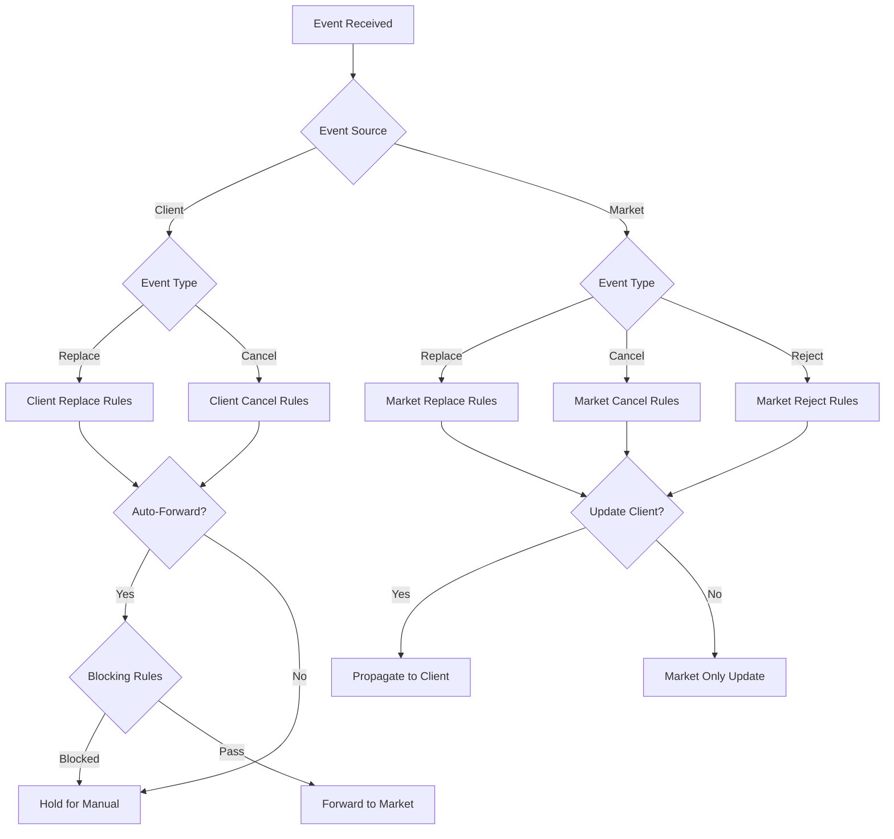

## 11. Edge Cases and Error Handling

### 11.1 Race Conditions

**Scenario: Replace and Fill arrive simultaneously**

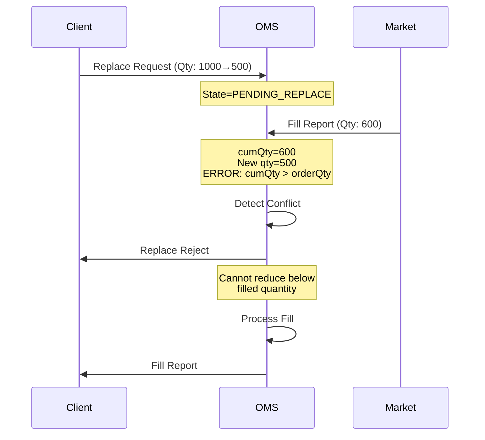

**Resolution Strategy:**
1. Lock order during state transition
2. Validate pending values against current `cumQty`
3. Reject replace if `pendingQty < cumQty`
4. Process events in sequence order (using event sequence number)

### 11.2 Multiple Market Orders

**Scenario: Client order split into 3 market orders**

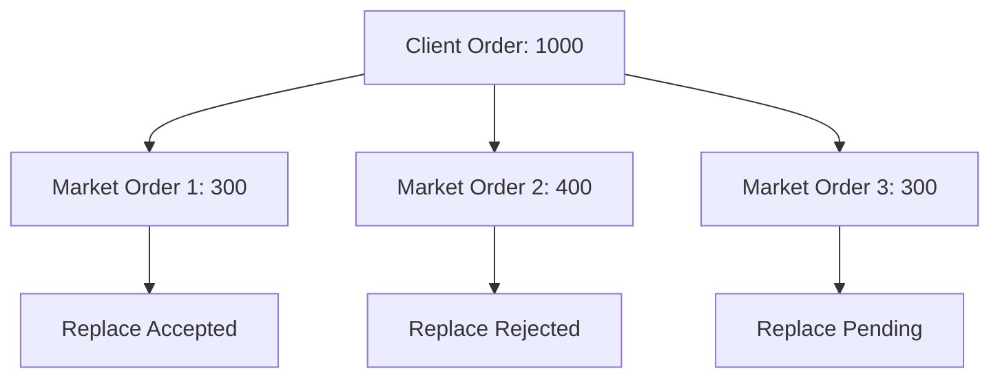

**Client Order State Resolution:**
- Wait for all market orders to respond
- If ANY reject: Notify client of partial replace failure
- Update client order with aggregate values
- Use eventual consistency model

### 11.3 Network Failures

**Timeout Handling:**

```java
@Service
public class ReplaceTimeoutHandler {
    
    @Scheduled(fixedDelay = 5000)
    public void checkPendingReplaces() {
        Instant timeout = Instant.now().minus(Duration.ofMinutes(2));
        
        List<Order> timedOut = orderRepository
            .findByStateAndTransactTimeBefore(OrderState.PENDING_REPLACE, timeout);
        
        for (Order order : timedOut) {
            // Check if market response was received via different channel
            if (!hasMarketResponse(order)) {
                // Escalate to manual review
                escalateToDesk(order, "Replace timeout - no market response");
            }
        }
    }
}
```

## 12. Monitoring and Metrics

### 12.1 Key Metrics

```java
@Component
public class OrderLifecycleMetrics {
    
    // Replace metrics
    @Counter
    private Counter replaceRequestsTotal;
    
    @Counter
    private Counter replaceAcceptedTotal;
    
    @Counter
    private Counter replaceRejectedTotal;
    
    @Timer
    private Timer replaceDuration; // Time from request to acceptance
    
    // Cancel metrics
    @Counter
    private Counter cancelRequestsTotal;
    
    @Counter
    private Counter cancelAcceptedTotal;
    
    @Counter
    private Counter cancelRejectedTotal;
    
    @Timer
    private Timer cancelDuration;
    
    // Reject metrics
    @Counter
    private Counter orderRejectsTotal;
    
    @Gauge
    private Gauge pendingReplaceCount;
    
    @Gauge
    private Gauge pendingCancelCount;
}
```

### 12.2 Dashboard Views

**Pending Operations Dashboard:**
- Orders in PENDING_REPLACE (age, client, desk assigned)
- Orders in PENDING_CANCEL (age, reason)
- Replace reject rate by reason
- Cancel reject rate by reason
- Average time to replace/cancel completion

**Propagation Monitoring:**
- Rules triggered count
- Blocked operations by rule
- Manual intervention queue depth
- Auto-forward success rate

## 13. Testing Scenarios

### 13.1 Replace Test Cases

1. **Happy Path - Simple Replace**
   - Submit replace, market accepts, client notified

2. **Replace Quantity Reduction**
   - Reduce quantity above filled amount
   - Verify `leavesQty` updated correctly

3. **Replace Price Change**
   - Change limit price while order active
   - Verify pending price stored, committed on accept

4. **Replace Reject - Too Late**
   - Order fully filled before replace processed
   - Verify reject with appropriate reason

5. **Replace with Partial Fill**
   - Order 50% filled, replace remaining quantity
   - Verify cumQty preserved, leavesQty adjusted

6. **Multiple Market Orders**
   - Client order split into 3 market orders
   - Replace all simultaneously
   - Handle mixed accept/reject responses

7. **Replace Chain**
   - Submit replace while previous replace pending
   - Verify rejection (already pending)

8. **Grouped Order Replace**
   - Replace order part of group
   - Verify blocking rule applied

### 13.2 Cancel Test Cases

1. **Cancel Before Market Send**
   - Cancel order not yet forwarded to market
   - Verify immediate cancel (no PENDING_CANCEL)

2. **Cancel Active Order**
   - Cancel order working at market
   - Verify PENDING_CANCEL → CANCELED flow

3. **Cancel Partially Filled Order**
   - Order 40% filled, cancel remaining
   - Verify `leavesQty` set to 0, `cumQty` preserved

4. **Cancel Reject - Already Filled**
   - Market fills order before cancel processed
   - Verify cancel reject with "Too late"

5. **Cancel Grouped Orders**
   - Cancel all orders in group
   - Verify all-or-none logic

6. **Unsolicited Cancel from Market**
   - Market cancels order (IOC expired, etc.)
   - Verify propagation to client

### 13.3 Reject Test Cases

1. **Validation Reject**
   - Submit order with invalid price
   - Verify immediate reject, no state created

2. **Market Reject - Unknown Symbol**
   - Market rejects with unknown symbol
   - Verify client notified

3. **Compliance Reject**
   - Order violates position limit
   - Verify reject before market send

4. **Duplicate Order Reject**
   - Resubmit same `clOrdID`
   - Verify duplicate detection reject

## 14. Future Considerations

1. **Mass Cancel/Replace**
   - Support FIX OrderMassCancelRequest (35=q)
   - Cancel all orders for symbol, side, or account

2. **Replace with Execution**
   - Handle simultaneous replace accept and partial fill
   - Atomic state update

3. **Order Grouping Strategies**
   - Wave orders
   - Basket orders
   - Portfolio transitions

4. **Advanced Propagation Rules**
   - Time-based rules (market hours, trading phases)
   - Risk-based rules (exposure limits)
   - Client-specific rules (SLA requirements)

5. **Audit Trail Enhancement**
   - Complete FIX message history
   - State transition visualization
   - Replay capabilities

6. **Performance Optimization**
   - Batch replace/cancel for multiple orders
   - Async event processing
   - Caching strategies for rules engine

---

## Appendix A: FIX Message Reference

### A.1 ExecType Values (FIX Tag 150)

| Code | Name | Description |
|------|------|-------------|
| 0 | New | New order |
| 4 | Canceled | Order canceled |
| 5 | Replace | Order replaced |
| 6 | Pending Cancel | Cancel request pending |
| 8 | Rejected | Order rejected |
| A | Pending New | New order pending |
| E | Pending Replace | Replace request pending |
| F | Trade | Execution (fill) |

### A.2 OrdStatus Values (FIX Tag 39)

| Code | Name | Description |
|------|------|-------------|
| 0 | New | Order accepted |
| 1 | Partially filled | Partial execution |
| 2 | Filled | Fully executed |
| 4 | Canceled | Canceled |
| 6 | Pending Cancel | Cancel pending |
| 8 | Rejected | Rejected |
| A | Pending New | New order pending |
| E | Pending Replace | Replace pending |
| 5 | Replaced | Successfully replaced |

---

**Document Version:** 1.0  
**Last Updated:** October 8, 2025  
**Status:** Draft for Review
