# Order Tree Calculations Specification

**Version:** 1.0  
**Last Updated:** 2025-10-08  
**Author:** Trading Systems Team  
**Status:** Draft

---

## 1. Introduction

This specification defines the calculation semantics for order quantity fields within hierarchical order trees in trading systems. An order tree represents the parent-child relationship between client orders (parent/root) and their market orders (children), following FIX Protocol semantics for quantity and price fields.

### 1.1 Purpose

- Define accurate quantity calculations across order tree hierarchies
- Prevent market risk through proper placement tracking
- Ensure correct allocation of executions from market to client orders
- Support both automated (STP) and manual allocation workflows

### 1.2 Scope

**In Scope:**
- Order tree hierarchy (client ↔ market orders)
- Quantity field calculations: `OrderQty`, `CumQty`, `LeavesQty`, `AvgPx`
- Placement tracking to prevent over-placement
- Execution allocation workflows (STP vs. manual)
- State transitions during allocation process

**Out of Scope:**
- Order routing algorithms
- Market-specific execution protocols
- Risk management policies
- Commission calculations

---

## 2. FIX Protocol Field Semantics

### 2.1 Core Quantity Fields

Following FIX Protocol 4.4/5.0 semantics:

| FIX Tag | Field Name | Description | Calculation |
|---------|------------|-------------|-------------|
| **38** | `OrderQty` | Original order quantity | Set at order creation; immutable |
| **14** | `CumQty` | Cumulative executed quantity | Sum of all execution quantities |
| **151** | `LeavesQty` | Remaining open quantity | `OrderQty - CumQty` |
| **6** | `AvgPx` | Average execution price | `Σ(ExecQty × ExecPrice) / CumQty` |

### 2.2 Additional Tracking Fields

| Field Name | Description | Purpose |
|------------|-------------|---------|
| `PlacedQty` | Quantity placed in market (sum of child orders) | Prevent over-placement |
| `AllocatedQty` | Quantity allocated to client | Track allocation progress |
| `PendingAllocQty` | Awaiting allocation approval | Manual allocation workflow |

---

## 3. Order Tree Structure

### 3.1 Hierarchy Model

```
Client Order (Root/Parent)
    ├── Market Order 1 (Child)
    ├── Market Order 2 (Child)
    └── Market Order N (Child)
```

**Characteristics:**
- **Client Order**: Parent/root order representing the client's trading intent
- **Market Order**: Child order sent to execution venues
- **Relationship**: 1 client order → N market orders (1:N)

### 3.2 Visual Representation

```mermaid
graph TB
    Client["<b>Client Order</b><br/>clOrdID: CLIENT-001<br/>─────────────────<br/>OrderQty: 1,000<br/>CumQty: 600<br/>LeavesQty: 400<br/>PlacedQty: 700<br/>AllocatedQty: 600"]
    
    Market1["<b>Market Order 1</b><br/>─────────────────<br/>OrderQty: 500<br/>CumQty: 500 ✓<br/>LeavesQty: 0"]
    Market2["<b>Market Order 2</b><br/>─────────────────<br/>OrderQty: 200<br/>CumQty: 100<br/>LeavesQty: 100"]
    
    Client --> Market1
    Client --> Market2
    
    style Client fill:#e1f5ff,stroke:#0366d6,stroke-width:3px
    style Market1 fill:#d4edda,stroke:#28a745,stroke-width:2px
    style Market2 fill:#fff3cd,stroke:#ffc107,stroke-width:2px
```



---

## 4. Quantity Calculation Rules

### 4.1 Client Order Calculations

#### 4.1.1 PlacedQty (Placement Tracking)

**Purpose**: Track total quantity sent to market to prevent over-placement.

**Calculation**:
```
ClientOrder.PlacedQty = Σ(ChildMarketOrder.OrderQty)
```

**Constraint**:
```
ClientOrder.PlacedQty ≤ ClientOrder.OrderQty
```

**Example**:
```
Client Order: OrderQty = 1,000
  Market Order 1: OrderQty = 500 → PlacedQty = 500
  Market Order 2: OrderQty = 300 → PlacedQty = 800
  Market Order 3 (rejected): OrderQty = 300 → PlacedQty exceeds limit (800 + 300 > 1,000)
```

#### 4.1.2 CumQty (Cumulative Executed)

**Purpose**: Total quantity executed across all child market orders.

**Calculation**:
```
ClientOrder.CumQty = Σ(ChildMarketOrder.AllocatedQty)
```

**Note**: Uses `AllocatedQty` (not `CumQty`) to support manual allocation workflows.

#### 4.1.3 LeavesQty (Remaining Open)

**Calculation**:
```
ClientOrder.LeavesQty = ClientOrder.OrderQty - ClientOrder.CumQty
```

#### 4.1.4 AvgPx (Average Price)

**Calculation**:
```
ClientOrder.AvgPx = Σ(ChildMarketOrder.AllocatedQty × ChildMarketOrder.AvgPx) / ClientOrder.CumQty
```

---

### 4.2 Market Order Calculations

#### 4.2.1 CumQty (Cumulative Executed)

**Calculation**:
```
MarketOrder.CumQty = Σ(Execution.LastQty)
```

Where `Execution.LastQty` is FIX Tag 32 (quantity in this execution).

#### 4.2.2 LeavesQty (Remaining Open)

**Calculation**:
```
MarketOrder.LeavesQty = MarketOrder.OrderQty - MarketOrder.CumQty
```

#### 4.2.3 AvgPx (Average Price)

**Calculation**:
```
MarketOrder.AvgPx = Σ(Execution.LastQty × Execution.LastPx) / MarketOrder.CumQty
```

---

## 5. Allocation Workflows

### 5.1 Allocation Modes

#### 5.1.1 Straight-Through Processing (STP)

**Characteristics**:
- Executions automatically allocated to client order
- No manual intervention required
- `AllocatedQty` updated immediately

**Indicator**:
```java
MarketOrder.autoAllocation = true
```

**Workflow**:


#### 5.1.2 Manual Allocation

**Characteristics**:
- Executions require validation before allocation
- Execution desk review
- Multi-step approval process

**Indicator**:
```java
MarketOrder.autoAllocation = false
```

**Workflow**:


---

### 5.2 Allocation State Machine

#### 5.2.1 Market Order States


#### 5.2.2 Allocation Tracking Fields

| Field | Description | Updated When |
|-------|-------------|--------------|
| `MarketOrder.CumQty` | Executed quantity | Execution received |
| `MarketOrder.AllocatedQty` | Allocated to client | Allocation approved |
| `MarketOrder.PendingAllocQty` | Awaiting approval | Manual mode, post-execution |

**Calculation**:
```
MarketOrder.PendingAllocQty = MarketOrder.CumQty - MarketOrder.AllocatedQty
```

---

## 6. Wireframes & Calculations

### 6.1 STP Allocation Flow

```mermaid
sequenceDiagram
    participant Client as 📋 Client Order<br/>CLIENT-001
    participant Market as 🏪 Market Order<br/>MKT-001 [STP]
    participant Exec as ⚡ Execution
    
    Note over Client: OrderQty: 1,000<br/>CumQty: 0<br/>PlacedQty: 500
    Note over Market: OrderQty: 500<br/>autoAllocation: true
    
    Exec->>Market: EXECUTION-1<br/>LastQty=300<br/>LastPx=100.00
    Market->>Market: CumQty = 300
    Market->>Client: 🔄 Auto-Allocate 300
    Note over Client: CumQty: 0→300<br/>AllocatedQty: 300
    
    Exec->>Market: EXECUTION-2<br/>LastQty=200<br/>LastPx=100.50
    Market->>Market: CumQty = 500<br/>AvgPx = 100.20
    Market->>Client: 🔄 Auto-Allocate 200
    Note over Client: CumQty: 500<br/>AllocatedQty: 500<br/>AvgPx: 100.20
    
    Note over Market: ✅ FILLED<br/>AllocatedQty: 500
    Note over Client: ✅ PARTIALLY FILLED<br/>LeavesQty: 500
```



**Result:**
- Client Order: `CumQty=500`, `AllocatedQty=500`, `AvgPx=100.20`
- Market Order: `CumQty=500`, `AllocatedQty=500`, State=**FILLED**

---

### 6.2 Manual Allocation Flow

```mermaid
sequenceDiagram
    participant Client as 📋 Client Order<br/>CLIENT-002
    participant Market as 🏪 Market Order<br/>MKT-002 [Manual]
    participant Exec as ⚡ Execution
    participant Desk as 👤 Execution Desk
    
    Note over Client: OrderQty: 1,000<br/>PlacedQty: 800
    Note over Market: OrderQty: 800<br/>autoAllocation: false
    
    Exec->>Market: EXECUTION-1<br/>LastQty=500<br/>LastPx=99.50
    Market->>Market: CumQty = 500<br/>PendingAllocQty = 500
    
    Note over Market: ⏳ PENDING_ALLOC
    
    Market->>Desk: Request Validation
    Note over Desk: ✓ Price vs limit<br/>✓ Counterparty<br/>✓ Compliance
    
    Desk-->>Market: ✅ APPROVED: 300 shares
    Market->>Client: Allocate 300
    Note over Client: CumQty: 300<br/>AllocatedQty: 300
    Note over Market: AllocatedQty: 300<br/>PendingAllocQty: 200
    
    Desk-->>Market: ❌ REJECTED: 200 shares
    Note over Market: ⚠️ ALLOC_FAILED<br/>Investigation Required
    
    Note over Client: ⚡ LIVE<br/>LeavesQty: 700
```



**Result:**
- Client Order: `CumQty=300`, `AllocatedQty=300`, `LeavesQty=700`
- Market Order: `CumQty=500`, `AllocatedQty=300`, `PendingAllocQty=200` (under review)

---

### 6.3 Multi-Child Order Tree

```mermaid
graph TB
    subgraph Client["📋 Client Order: CLIENT-003"]
        C1["OrderQty: 2,000<br/>CumQty: 1,200<br/>LeavesQty: 800<br/>─────────────<br/>PlacedQty: 1,500<br/>AllocatedQty: 1,200<br/>AvgPx: 50.25"]
    end
    
    subgraph Market1["🏪 Market Order A [STP]"]
        M1["OrderQty: 1,000<br/>CumQty: 1,000 ✅<br/>LeavesQty: 0<br/>─────────────<br/>AllocatedQty: 1,000<br/>AvgPx: 50.10"]
    end
    
    subgraph Market2["🏪 Market Order B [Manual]"]
        M2["OrderQty: 500<br/>CumQty: 300<br/>LeavesQty: 200<br/>─────────────<br/>AllocatedQty: 200<br/>PendingAllocQty: 100<br/>AvgPx: 50.80"]
    end
    
    Client --> Market1
    Client --> Market2
    
    style Client fill:#e1f5ff,stroke:#0366d6,stroke-width:3px
    style Market1 fill:#d4edda,stroke:#28a745,stroke-width:2px
    style Market2 fill:#fff3cd,stroke:#ffc107,stroke-width:2px
```



**Calculations:**
```
Client.PlacedQty = 1,000 + 500 = 1,500 ✓
Client.AllocatedQty = 1,000 + 200 = 1,200 ✓
Client.CumQty = 1,200 (allocated qty)
Client.AvgPx = (1,000 × 50.10 + 200 × 50.80) / 1,200 = 50.25
```

---

## 7. Edge Cases & Business Rules

### 7.1 Over-Placement Prevention

**Rule**: Prevent placing more quantity than client order allows.

```java
if (clientOrder.placedQty + newMarketOrder.orderQty > clientOrder.orderQty) {
    throw new OrderException("Placement would exceed client order quantity");
}
```

**Example**:
```
Client Order: OrderQty = 1,000
  Existing PlacedQty = 800
  New Market Order: OrderQty = 300
  Result: 800 + 300 = 1,100 > 1,000 → REJECT
```

---

### 7.2 Partial Allocation

**Scenario**: Market order partially filled, STP allocation mode.

```
Market Order: OrderQty=1,000, CumQty=600 (partial fill)
Client Order: CumQty updated to 600 immediately (STP)
```

**Manual Mode**:
```
Market Order: OrderQty=1,000, CumQty=600 (partial fill)
PendingAllocQty = 600 (awaiting approval)
Client Order: CumQty remains 0 until approved
```

---

### 7.3 Allocation Failure Handling

**Scenario**: Execution validation fails.

**State Transition**:
```
Market Order: EXECUTED → ALLOC_FAILED
PendingAllocQty moved to investigation queue
Client Order: CumQty NOT updated
```

**Investigation Workflow**:
1. Execution desk reviews failed allocation
2. Resolve issue (price correction, compliance approval, etc.)
3. Manual allocation or cancellation

---

### 7.4 Child Order Cancellation

**Rule**: Cancel unexecuted portion of market order.

**Impact on Client Order**:
```java
// Market order cancelled with LeavesQty
clientOrder.placedQty -= marketOrder.leavesQty;
```

**Example**:
```
Client Order: PlacedQty = 1,000
Market Order: OrderQty = 500, CumQty = 300, LeavesQty = 200 → CANCELLED
Client Order: PlacedQty = 1,000 - 200 = 800
```

---

## 8. Data Model

### 8.1 Client Order Entity

```java
@Entity
@Table(name = "client_orders")
public class ClientOrder {
    
    @Id
    private String clOrdID;
    
    // FIX Protocol fields
    @Column(nullable = false)
    private BigDecimal orderQty;        // Tag 38
    
    @Column(nullable = false)
    private BigDecimal cumQty;          // Tag 14
    
    @Column(nullable = false)
    private BigDecimal leavesQty;       // Tag 151
    
    @Column
    private BigDecimal avgPx;           // Tag 6
    
    // Order tree tracking
    @Column(nullable = false)
    private BigDecimal placedQty;       // Sum of child OrderQty
    
    @Column(nullable = false)
    private BigDecimal allocatedQty;    // Sum of child AllocatedQty
    
    // Relationships
    @OneToMany(mappedBy = "clientOrder")
    private List<MarketOrder> marketOrders;
    
    // Calculation methods
    public void updateFromAllocations() {
        this.placedQty = marketOrders.stream()
            .map(MarketOrder::getOrderQty)
            .reduce(BigDecimal.ZERO, BigDecimal::add);
            
        this.allocatedQty = marketOrders.stream()
            .map(MarketOrder::getAllocatedQty)
            .reduce(BigDecimal.ZERO, BigDecimal::add);
            
        this.cumQty = this.allocatedQty;
        this.leavesQty = this.orderQty.subtract(this.cumQty);
        
        this.avgPx = calculateWeightedAvgPrice();
    }
    
    private BigDecimal calculateWeightedAvgPrice() {
        BigDecimal totalNotional = marketOrders.stream()
            .map(m -> m.getAllocatedQty().multiply(m.getAvgPx()))
            .reduce(BigDecimal.ZERO, BigDecimal::add);
            
        return cumQty.compareTo(BigDecimal.ZERO) > 0
            ? totalNotional.divide(cumQty, 4, RoundingMode.HALF_UP)
            : BigDecimal.ZERO;
    }
}
```

---

### 8.2 Market Order Entity

```java
@Entity
@Table(name = "market_orders")
public class MarketOrder {
    
    @Id
    private String orderId;
    
    // FIX Protocol fields
    @Column(nullable = false)
    private BigDecimal orderQty;        // Tag 38
    
    @Column(nullable = false)
    private BigDecimal cumQty;          // Tag 14
    
    @Column(nullable = false)
    private BigDecimal leavesQty;       // Tag 151
    
    @Column
    private BigDecimal avgPx;           // Tag 6
    
    // Allocation tracking
    @Column(nullable = false)
    private BigDecimal allocatedQty;    // Allocated to client
    
    @Column(nullable = false)
    private BigDecimal pendingAllocQty; // Awaiting approval
    
    @Column(nullable = false)
    private boolean autoAllocation;     // STP flag
    
    @Enumerated(EnumType.STRING)
    private AllocationState allocState; // NEW, PENDING_ALLOC, ALLOCATED, ALLOC_FAILED
    
    // Relationships
    @ManyToOne
    @JoinColumn(name = "client_order_id")
    private ClientOrder clientOrder;
    
    @OneToMany(mappedBy = "marketOrder")
    private List<Execution> executions;
    
    // Calculation methods
    public void processExecution(Execution exec) {
        this.cumQty = this.cumQty.add(exec.getLastQty());
        this.leavesQty = this.orderQty.subtract(this.cumQty);
        this.avgPx = calculateWeightedAvgPrice();
        
        if (autoAllocation) {
            allocateToClient(exec.getLastQty());
        } else {
            this.pendingAllocQty = this.pendingAllocQty.add(exec.getLastQty());
            this.allocState = AllocationState.PENDING_ALLOC;
        }
    }
    
    private void allocateToClient(BigDecimal qty) {
        this.allocatedQty = this.allocatedQty.add(qty);
        this.allocState = AllocationState.ALLOCATED;
        clientOrder.updateFromAllocations();
    }
    
    private BigDecimal calculateWeightedAvgPrice() {
        BigDecimal totalNotional = executions.stream()
            .map(e -> e.getLastQty().multiply(e.getLastPx()))
            .reduce(BigDecimal.ZERO, BigDecimal::add);
            
        return cumQty.compareTo(BigDecimal.ZERO) > 0
            ? totalNotional.divide(cumQty, 4, RoundingMode.HALF_UP)
            : BigDecimal.ZERO;
    }
}
```

---

### 8.3 Execution Entity

```java
@Entity
@Table(name = "executions")
public class Execution {
    
    @Id
    private String execId;              // Tag 17
    
    @Column(nullable = false)
    private BigDecimal lastQty;         // Tag 32
    
    @Column(nullable = false)
    private BigDecimal lastPx;          // Tag 31
    
    @ManyToOne
    @JoinColumn(name = "market_order_id")
    private MarketOrder marketOrder;
    
    @Column(nullable = false)
    private Instant transactTime;       // Tag 60
}
```

---

## 9. Validation Rules

### 9.1 Placement Validation

```java
public void validatePlacement(ClientOrder client, MarketOrder market) {
    BigDecimal newPlacedQty = client.getPlacedQty().add(market.getOrderQty());
    
    if (newPlacedQty.compareTo(client.getOrderQty()) > 0) {
        throw new OrderException(
            "Placement exceeds client order quantity: " +
            newPlacedQty + " > " + client.getOrderQty()
        );
    }
}
```

---

### 9.2 Allocation Validation

```java
public void validateAllocation(MarketOrder market, BigDecimal allocQty) {
    if (allocQty.compareTo(market.getCumQty()) > 0) {
        throw new AllocationException(
            "Cannot allocate more than executed: " +
            allocQty + " > " + market.getCumQty()
        );
    }
    
    BigDecimal newAllocated = market.getAllocatedQty().add(allocQty);
    if (newAllocated.compareTo(market.getCumQty()) > 0) {
        throw new AllocationException("Over-allocation detected");
    }
}
```

---

### 9.3 Quantity Consistency

```java
public void validateQuantityInvariants(ClientOrder client) {
    // PlacedQty must equal sum of child OrderQty
    BigDecimal expectedPlaced = client.getMarketOrders().stream()
        .map(MarketOrder::getOrderQty)
        .reduce(BigDecimal.ZERO, BigDecimal::add);
        
    assert client.getPlacedQty().compareTo(expectedPlaced) == 0;
    
    // CumQty must equal AllocatedQty
    assert client.getCumQty().compareTo(client.getAllocatedQty()) == 0;
    
    // LeavesQty must equal OrderQty - CumQty
    BigDecimal expectedLeaves = client.getOrderQty().subtract(client.getCumQty());
    assert client.getLeavesQty().compareTo(expectedLeaves) == 0;
}
```

---

## 10. State Machine

### 10.1 Allocation States

```java
public enum AllocationState {
    NEW,            // Market order created, not executed
    PENDING_ALLOC,  // Executed, awaiting allocation approval
    ALLOCATED,      // Allocated to client order
    ALLOC_FAILED    // Allocation validation failed
}
```

---

### 10.2 State Transitions


---

## 11. Integration with Order State Machine

Reference: `domain-model_spec.md` - State Machine Engine

### 11.1 Combined State Transitions

```mermaid
sequenceDiagram
    participant CO as Client Order
    participant MO as Market Order
    participant E as Execution
    
    Note over CO: State: NEW
    CO->>MO: Place Market Order
    Note over MO: State: NEW → PENDING
    Note over CO: PlacedQty updated
    
    E->>MO: Execution Received
    Note over MO: State: PENDING → FILLED<br/>CumQty updated
    
    alt STP Mode
        MO->>CO: Auto-Allocate
        Note over CO: State: NEW → LIVE → PARTIALLY_FILLED<br/>CumQty updated immediately
    else Manual Mode
        Note over MO: AllocState = PENDING_ALLOC
        Note over CO: State unchanged until approval
    end
```



---

## 12. Reporting & Monitoring

### 12.1 Key Metrics

| Metric | Formula | Purpose |
|--------|---------|---------|
| Placement Utilization | `PlacedQty / OrderQty × 100%` | Monitor order coverage |
| Allocation Rate | `AllocatedQty / CumQty × 100%` | Track allocation efficiency |
| Pending Allocation | `PendingAllocQty` sum across orders | Manual review queue size |

---

### 12.2 Alerts

**Over-Placement Detection**:
```sql
SELECT * FROM client_orders
WHERE placed_qty > order_qty;
```

**Stuck Allocations**:
```sql
SELECT * FROM market_orders
WHERE alloc_state = 'PENDING_ALLOC'
  AND updated_at < NOW() - INTERVAL '1 hour';
```

**Allocation Failures**:
```sql
SELECT * FROM market_orders
WHERE alloc_state = 'ALLOC_FAILED'
ORDER BY updated_at DESC;
```

---

## 13. Testing Scenarios

### 13.1 Test Case 1: STP Single Child

```
Given:
  Client Order: OrderQty = 1,000
  Market Order: OrderQty = 1,000, autoAllocation = true
  
When:
  Execution-1: LastQty = 500, LastPx = 100.00
  Execution-2: LastQty = 500, LastPx = 101.00
  
Then:
  Market Order: CumQty = 1,000, AllocatedQty = 1,000, AvgPx = 100.50
  Client Order: CumQty = 1,000, AllocatedQty = 1,000, AvgPx = 100.50
  State: Both FILLED
```

---

### 13.2 Test Case 2: Manual Allocation

```
Given:
  Client Order: OrderQty = 1,000
  Market Order: OrderQty = 1,000, autoAllocation = false
  
When:
  Execution: LastQty = 800, LastPx = 50.00
  
Then:
  Market Order: CumQty = 800, PendingAllocQty = 800, AllocatedQty = 0
  Client Order: CumQty = 0 (no allocation yet)
  AllocState: PENDING_ALLOC
  
When:
  Allocation approved: 600 shares
  
Then:
  Market Order: AllocatedQty = 600, PendingAllocQty = 200
  Client Order: CumQty = 600, AllocatedQty = 600
```

---

### 13.3 Test Case 3: Multi-Child Tree

```
Given:
  Client Order: OrderQty = 2,000
  Market Order A: OrderQty = 1,200, autoAllocation = true
  Market Order B: OrderQty = 800, autoAllocation = true
  
When:
  Market A: Execution LastQty = 1,200, LastPx = 100.00 → FILLED
  Market B: Execution LastQty = 500, LastPx = 101.00 → PARTIAL
  
Then:
  Client Order:
    PlacedQty = 2,000
    AllocatedQty = 1,700 (1,200 + 500)
    CumQty = 1,700
    AvgPx = (1,200×100 + 500×101) / 1,700 = 100.29
    LeavesQty = 300
```

---

## 14. References

- **FIX Protocol 4.4 Specification**: Tag definitions for OrderQty (38), CumQty (14), LeavesQty (151), AvgPx (6)
- **`oms_spec.md`**: Order Management System architecture
- **`domain-model_spec.md`**: State Machine Engine, base entity model
- **`state-query-store_spec.md`**: Event sourcing and state management

---

## 15. Appendix: Calculation Examples

### 15.1 Average Price Calculation

```
Executions:
  Exec-1: Qty = 300, Px = 100.00 → Notional = 30,000
  Exec-2: Qty = 500, Px = 100.50 → Notional = 50,250
  Exec-3: Qty = 200, Px = 99.50  → Notional = 19,900

AvgPx = (30,000 + 50,250 + 19,900) / (300 + 500 + 200)
      = 100,150 / 1,000
      = 100.15
```

---

### 15.2 Multi-Level AvgPx Rollup

```
Client Order:
  Market Order 1:
    Exec-A: 400 @ 50.00 → AvgPx = 50.00
    Exec-B: 600 @ 50.50 → AvgPx = 50.30
    Total: AllocatedQty = 1,000, AvgPx = 50.30
    
  Market Order 2:
    Exec-C: 500 @ 51.00 → AvgPx = 51.00
    Total: AllocatedQty = 500, AvgPx = 51.00
    
Client AvgPx = (1,000 × 50.30 + 500 × 51.00) / 1,500
             = (50,300 + 25,500) / 1,500
             = 50.53
```

---

## Revision History

| Version | Date | Author | Changes |
|---------|------|--------|---------|
| 1.0 | 2025-10-08 | Trading Systems Team | Initial draft |
