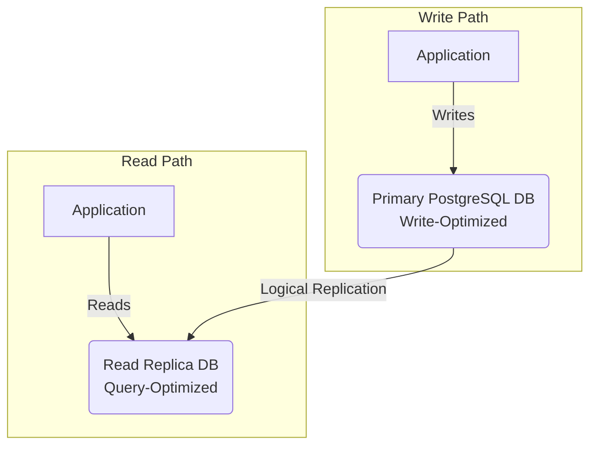
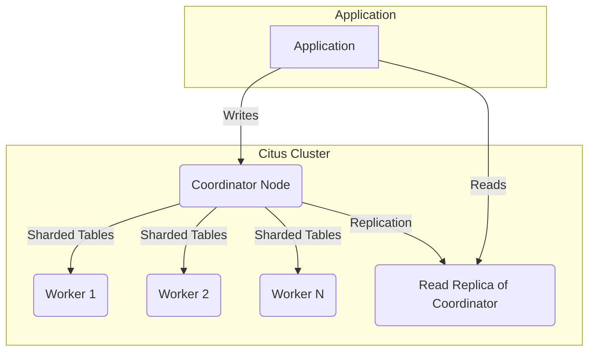
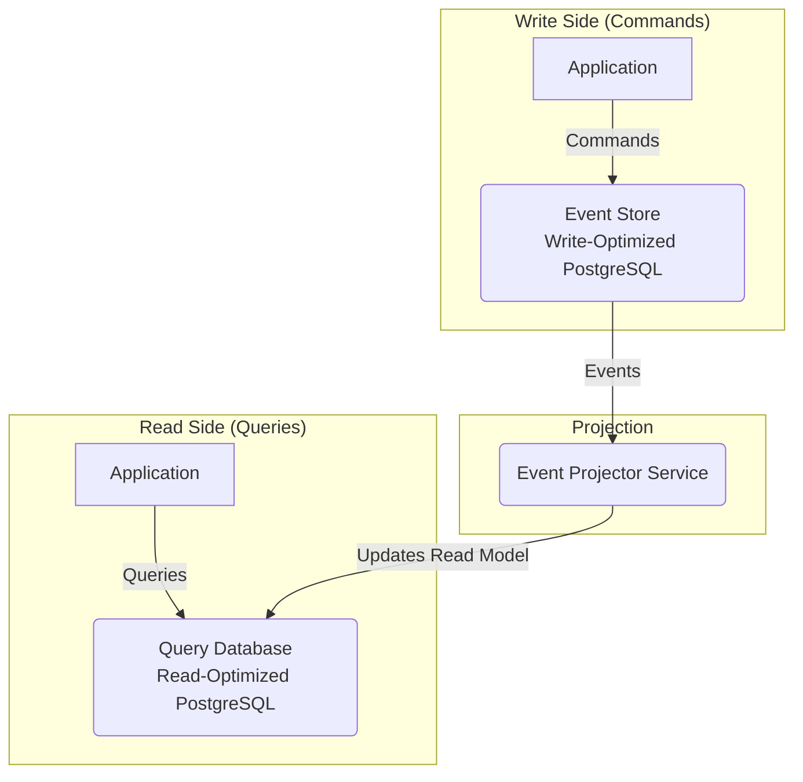
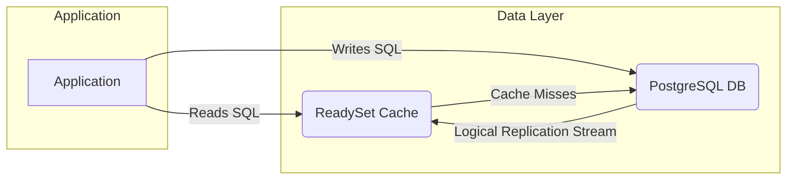

# State-Query Store CQRS Specification

This document outlines and evaluates various approaches for implementing a read-optimized query store that is synchronized with a primary, write-optimized transaction store. This pattern is a form of Command Query Responsibility Segregation (CQRS) at the database level, aimed at optimizing performance for both write and read operations.

## 1. Azure Database for PostgreSQL Flexible Server with Logical Replication

### Architecture

### Concept

This is the recommended approach, leveraging PostgreSQL's built-in logical replication capabilities within the Azure Database for PostgreSQL Flexible Server. It involves a primary (write) server and one or more read replica servers.

### How it Works

-   **Primary Server (Write-Optimized):** An Azure Database for PostgreSQL Flexible Server instance is configured for high write throughput. This includes appropriate server sizing (CPU, memory, storage), using Premium SSDs, and tuning PostgreSQL parameters like `wal_level` and `synchronous_commit`. Unlogged tables can be considered for performance-critical data where durability is less of a concern.
-   **Read Replica Server(s) (Query-Optimized):** One or more read replicas are created from the primary server. These replicas are automatically synchronized using logical replication and are optimized for read operations with appropriate sizing, query-specific indexes, and read-only connections.
-   **Logical Replication Setup:** Azure's management layer simplifies the process of enabling logical replication on the primary and configuring replicas to subscribe to changes.
-   **Application Configuration:** The application is configured to direct write operations to the primary server and read operations to the read replica(s).

### Pros

-   **Managed Service:** Azure manages the replication process, simplifying setup and maintenance.
-   **Near Real-Time Replication:** Logical replication provides low-latency data synchronization.
-   **Read Scalability:** Read operations can be scaled out by adding more read replicas.
-   **Minimal Application Changes:** The pattern requires relatively few code modifications.
-   **Cost-Effective:** It is generally more cost-effective than more complex solutions.
-   **Flexible Server Advantages:** The Flexible Server deployment option offers greater control over configuration and maintenance.

### Cons

-   **Replication Lag:** A degree of replication lag is inherent, meaning read replicas may not be perfectly up-to-date. This lag should be monitored.
-   **Consistency Considerations:** The application must be designed to handle potential data inconsistencies arising from the replication lag.
-   **Write Performance Impact:** Heavy read activity on replicas can still indirectly impact the primary's write performance if they contend for shared resources.
-   **Replication Complexity:** While simplified by Azure, a proper understanding of PostgreSQL replication is still necessary for correct configuration.

## 2. Azure Database for PostgreSQL Hyperscale (Citus) with Read Replicas

### Architecture

### Concept

Azure Database for PostgreSQL Hyperscale (Citus) is a distributed database that shards data across multiple nodes. Read replicas can be added to the coordinator node to scale read-heavy workloads.

### How it Works

-   **Hyperscale (Citus) Setup:** An Azure Database for PostgreSQL Hyperscale (Citus) cluster is created, and the database schema is designed for sharding across worker nodes.
-   **Coordinator Node:** This node serves as the entry point for queries, distributing them to the appropriate worker nodes.
-   **Read Replicas:** Read replicas are added to the coordinator node and are synchronized with it.
-   **Application Configuration:** The application directs write operations to the coordinator node and read operations to the read replicas of the coordinator.

### Pros

-   **High Scalability:** Citus offers excellent scalability for both read and write operations.
-   **Distributed Queries:** Queries are automatically distributed across worker nodes, improving performance.
-   **Additional Read Scalability:** Read replicas provide a further tier of read scalability.

### Cons

-   **Complexity:** Citus is more complex to set up and manage than a single PostgreSQL instance.
-   **Schema Design:** Designing a sharded database schema requires careful planning and consideration.
-   **Query Limitations:** Some complex queries may not be fully supported by Citus.
-   **Cost:** Citus can be more expensive, particularly for large clusters.
-   **Replication Lag:** Similar to logical replication, there will be a lag between the primary and replicas.

## 3. Event Sourcing + CQRS (With Separate Databases)

### Architecture

### Concept

This approach leverages an Event Sourcing pattern to create explicitly separate databases for the command (write) and query (read) sides of the application.

### How it Works

-   **Command Database (Write-Optimized):** The existing event store serves as the source of truth and is optimized for write operations.
-   **Query Database (Read-Optimized):** A separate PostgreSQL database is created specifically for queries, containing a denormalized, read-optimized view of the data.
-   **Event Consumption and Projection:** A dedicated service or application component consumes events from the event store and projects them into the query database. This involves transforming events into the appropriate format for the read model.
-   **Application Configuration:** The application writes events to the event store and reads data from the query database.

### Pros

-   **Complete Separation:** This provides full segregation of read and write operations, allowing for independent optimization and scaling.
-   **Independent Optimization:** The command and query databases can be tailored to their specific workloads without compromise.
-   **Maximum Scalability:** This architecture offers the highest potential for scalability.

### Cons

-   **Complexity:** This is the most complex option to implement and maintain.
-   **Eventual Consistency:** The delay between an event being stored and the query database being updated can be longer than with logical replication.
-   **Increased Development Effort:** Significant development is required to build and maintain the event consumption and projection logic.
-   **Operational Overhead:** Managing multiple databases increases operational complexity.

## 4. ReadySet Caching Layer

### Architecture

### Concept

ReadySet is a SQL caching engine that acts as a proxy between the application and the database. It caches query results and keeps them updated in real-time by listening to the database's replication stream.

### How it Works

-   **Proxy Layer:** ReadySet sits between your application and your PostgreSQL database.
-   **Query Caching:** It caches the results of `SELECT` queries.
-   **Real-time Updates:** ReadySet connects to the database's logical replication stream to monitor for data changes (`INSERT`, `UPDATE`, `DELETE`). When a change occurs that affects a cached query result, ReadySet automatically and incrementally updates the cache.
-   **Application Configuration:** The application connects to ReadySet instead of directly to the database for read queries. Write queries can be sent directly to the database or through ReadySet.

### Pros

-   **Transparent Caching:** Requires minimal application changes. You don't need to manage cache invalidation logic.
-   **High Performance:** Serves cached query results from memory, leading to very low-latency reads.
-   **Reduced Database Load:** Offloads read traffic from the primary database, freeing up resources for write operations.
-   **Real-time:** The cache is kept up-to-date in near real-time.

### Cons

-   **Unsupported Queries:** ReadySet may not support all SQL queries for caching, particularly those with non-deterministic functions or complex joins.
-   **Added Complexity:** Introduces another component into the architecture that needs to be managed and monitored.
-   **Cost:** ReadySet is a commercial product (with a BSL license), which adds to the overall cost of the solution.
-   **Maturity:** As a newer technology, it may not have the same level of community support or battle-tested history as native PostgreSQL replication.

## Summary

The choice of architecture depends on the specific requirements of the application, including performance needs, scalability goals, development resources, and operational capacity.

-   **Logical Replication** is a balanced and cost-effective choice for many applications.
-   **Citus** is ideal for applications requiring massive scale and distributed query performance.
-   **Event Sourcing with CQRS** provides the most flexibility and scalability but at the cost of complexity.
-   **ReadySet** offers a compelling solution for offloading read traffic with minimal application changes, but with the trade-offs of a commercial product and potential query limitations.
