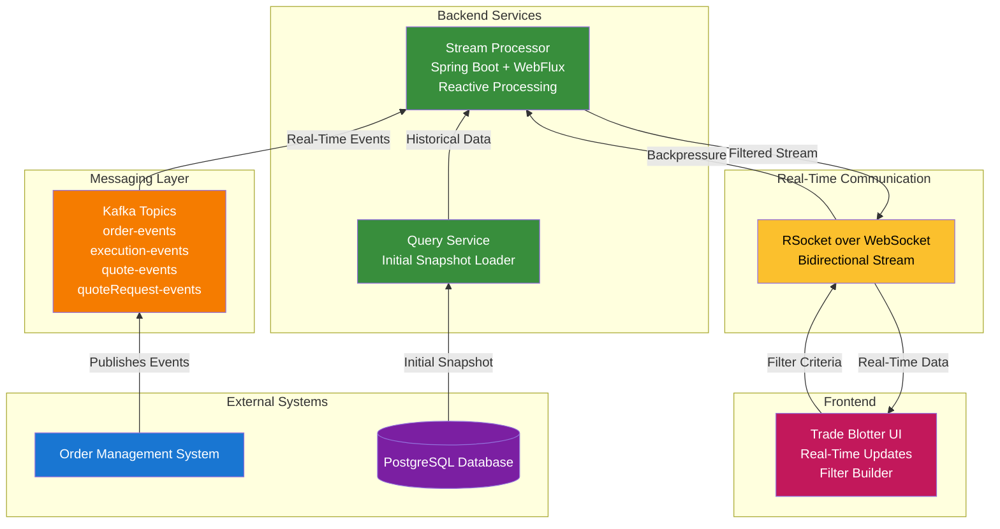

# Trade Blotter Backend Component Specification

---

## Table of Contents

1. [Introduction](#1-introduction)
2. [Goals](#2-goals)
3. [Architecture and Principles](#3-architecture-and-principles)
4. [Technology Stack](#4-technology-stack)
5. [Visual Concepts & UI Design](#visual-concepts--ui-design)
6. [Data Model](#5-data-model)
7. [Endpoints](#6-endpoints)
8. [Data Flow](#7-data-flow)
9. [Filtering](#8-filtering)
10. [Real-Time Communication](#9-real-time-communication)
11. [Error Handling](#10-error-handling)
12. [Security](#11-security)
13. [Scalability and Performance](#12-scalability-and-performance)
14. [Monitoring and Logging](#13-monitoring-and-logging)
15. [API Versioning](#14-api-versioning)
16. [Improvements and Considerations](#improvements-and-considerations)

---

**1. Introduction**

This document specifies the design and functionality of the backend component responsible for providing real-time data streams to the Trade Blotter user interface. The Trade Blotter allows users to monitor and manage orders, executions, quote requests, and quotes, with customizable filters and views. This component will provide the data feed, metadata, and filtering capabilities required to support the Trade Blotter's functionality.

**2. Goals**

*   Provide a real-time, low-latency data stream to the Trade Blotter UI.
*   Support customizable filters defined by the user.
*   Offer metadata describing the available data fields and their properties.
*   Enable flow control and backpressure to handle varying consumer speeds.
*   Provide an efficient mechanism for initializing the data stream with historical data.
*   Support multiple concurrent Trade Blotter instances with different configurations.

**3. Architecture and Principles**

*   **Reactive Programming:** Leverage Spring Reactor and WebFlux for asynchronous, non-blocking data processing.
*   **Streaming Architecture:** Design the component to efficiently handle high volumes of real-time data.
*   **Scalability and Performance:** Optimize the component for low latency and high throughput.
*   **Loose Coupling:** Decouple the backend from the UI implementation details as much as possible.
*   **Resilience:** Ensure the component can gracefully handle errors and recover from failures.

**4. Technology Stack**

*   **Programming Language:** Java 21
*   **Framework:** Spring Boot, Spring WebFlux, Spring Reactor
*   **Reactive Data Access:** Spring Data R2DBC
*   **Messaging:** Confluent Kafka (for receiving real-time events)
*   **Real-Time Protocol:** RSocket over WebSocket (for bidirectional communication with the UI)
*   **Serialization:** JSON with Jackson

## Visual Concepts & UI Design

### Trade Blotter Interface

```
---------------------------------------------------
| Trade Blotter                                   |
|-------------------------------------------------|
| [Filter Panel]   [Order Table / Grid]           |
|-------------------------------------------------|
| [Status] [Symbol] [Qty] [Price] [Actions]       |
|-------------------------------------------------|
| NEW     AAPL     100   175.20   [View] [Edit]   |
| FILLED  MSFT     50    320.10   [View]          |
| ...                                             |
---------------------------------------------------
| [Real-Time Updates: Connected]                  |
---------------------------------------------------
```

### Data Flow Architecture

```
   [OMS]
     |
   [Kafka Topics] ---> [Backend Stream Processor] ---> [WebSocket/RSocket] ---> [Trade Blotter UI]
     ^                 |                                 |
     |                 v                                 v
   [Query Service] <--- [Initial Snapshot Loader]         [User Filter Input]
```

### Filter Builder Interface

```
----------------------------------------------------
| Filter Builder                                   |
|--------------------------------------------------|
| Field: [status]  Operator: [equals] Value: [NEW] |
| [Add Condition] [AND/OR]                         |
| Field: [orderQty] Operator: [> ] Value: [1000]   |
|--------------------------------------------------|
| [Apply Filter]                                   |
----------------------------------------------------
```

### Architecture Diagram



**5. Data Model**

*   The data model consists of the following domain objects:
    *   `Order`
    *   `Execution`
    *   `QuoteRequest`
    *   `Quote`
*   Each domain object has a well-defined schema with attributes like:
    *   Field Name
    *   Data Type (e.g., String, Integer, Double, Date)
    *   Description
    *   Value Range (if applicable)
    *   Units (if applicable)
*   **Event Sequence:**  Each state change event includes a sequence number, allowing the backend to determine the latest version of an object.

**6. Endpoints**

*   **Data Stream Endpoint (RSocket over WebSocket):**
    *   Path: `/trade-blotter/stream`
    *   Purpose: Provides a real-time stream of domain objects to the UI.
    *   Parameters:
        *   `blotterId`:  Unique identifier for the Trade Blotter instance.
        *   `filter`: A JSON object representing the user-defined filter criteria (see Section 8).
    *   Data Format: A Flux of serialized domain objects (e.g., `Flux<Order>`, `Flux<Execution>`).
    *   Flow Control: Supports backpressure to allow the UI to control the rate of data consumption.
*   **Metadata Endpoint (REST):**
    *   Path: `/trade-blotter/metadata`
    *   Purpose: Provides metadata about the available domain objects and their attributes.
    *   Method: `GET`
    *   Response Format: JSON array containing metadata for each domain object.

    ```json
    // Example Metadata Response
    [
      {
        "objectType": "Order",
        "fields": [
          {
            "name": "orderId",
            "dataType": "String",
            "description": "Unique identifier for the order",
            "filterable": true,
            "sortable": true
          },
          {
            "name": "clOrdID",
            "dataType": "String",
            "description": "Client Order ID (FIX Tag 11)",
            "filterable": true,
            "sortable": true
          },
          // ... other fields
        ]
      },
      // ... other object types (Execution, QuoteRequest, Quote)
    ]
    ```

**7. Data Flow**

1.  **UI Request:** The UI requests a data stream from the `/trade-blotter/stream` endpoint, providing the `blotterId` and `filter`.
2.  **Initial Data Load:**
    *   The backend retrieves all entities matching the specified filter from the database or query engine. This provides an initial snapshot of the data.
    *   The retrieval uses reactive data access technologies to avoid blocking the event loop.
3.  **Kafka Event Subscription:** The backend subscribes to the relevant Kafka topics (e.g., `order-events`, `execution-events`) to receive real-time updates.
4.  **Data Merging:**
    *   The backend merges the initial data snapshot with the real-time event stream.
    *   For each event, the backend updates the corresponding domain object in the stream.
    *   The event sequence number is used to determine the latest version of each object.
5.  **Filtering:**
    *   The backend applies the user-defined filter to the merged data stream.
    *   Only objects that match the filter criteria are passed to the UI.
6.  **Data Streaming:** The backend streams the filtered data to the UI using RSocket over WebSocket.

**8. Filtering**

*   **Filter Definition:** Users define filters in the UI using a visual interface (e.g., AG Grid's filtering capabilities).
*   **Filter Format:** Filters are represented as a JSON object that is sent to the backend. The JSON object should support:
    *   **Field Name:** The name of the field to filter on.
    *   **Operator:** The comparison operator (e.g., equals, not equals, greater than, less than, contains).
    *   **Value:** The value to compare against.
    *   **Logical Operators:** Support for combining multiple filter conditions using logical operators (e.g., AND, OR, NOT).

    ```json
    // Example Filter
    {
      "logicalOperator": "AND",
      "filters": [
        {
          "fieldName": "status",
          "operator": "equals",
          "value": "NEW"
        },
        {
          "fieldName": "orderQty",
          "operator": "greaterThan",
          "value": 1000
        }
      ]
    }
    ```

*   **Filter Application:** The backend applies the filter to the data stream using reactive operators (e.g., `filter` from Spring Reactor).
*   **Security:** The filter criteria must be validated to prevent malicious users from injecting code or accessing unauthorized data. Implement safeguards to prevent SQL injection or other security vulnerabilities.

**9. Real-Time Communication (RSocket over WebSocket)**

*   **RSocket:** Use RSocket for bidirectional communication between the backend and the UI. RSocket provides features like:
    *   **Request/Response:** For the initial metadata request.
    *   **Request/Stream:** For streaming data to the UI.
    *   **Fire-and-Forget:** For sending non-critical updates from the UI to the backend.
    *   **Backpressure:** Allows the UI to control the rate of data consumption.
*   **WebSocket:** Use WebSocket as the transport layer for RSocket.
*   **Benefits:** Improved performance, scalability, and reliability compared to traditional REST-based approaches.

**10. Error Handling**

*   **Global Exception Handling:** Implement a global exception handler to catch and log any unhandled exceptions.
*   **Error Propagation:** Propagate errors to the UI in a user-friendly format.
*   **Retry Mechanisms:** Implement retry mechanisms for transient errors (e.g., Kafka connection errors).
*   **Circuit Breaker:** Use a circuit breaker pattern to prevent cascading failures.

**11. Security**

*   **Authentication and Authorization:** Implement authentication and authorization to ensure that only authorized users can access the data stream.
*   **Data Encryption:** Encrypt data in transit using TLS.
*   **Input Validation:** Validate all user inputs to prevent security vulnerabilities.
*   **Rate Limiting:** Implement rate limiting to prevent abuse.

**12. Scalability and Performance**

*   **Asynchronous Processing:** Leverage asynchronous processing and non-blocking I/O to maximize performance.
*   **Caching:** Implement caching to reduce database load (if applicable).
*   **Horizontal Scalability:** Design the component to be horizontally scalable.

**13. Monitoring and Logging**

*   **Metrics:** Expose key metrics (e.g., data stream latency, throughput, error rates) for monitoring.
*   **Logging:** Implement comprehensive logging to facilitate debugging and troubleshooting.
*   **Distributed Tracing:** Use distributed tracing to track requests across multiple services.

**14. API Versioning**

*   Implement API versioning to allow for future changes to the API without breaking existing clients.

**Improvements and Considerations:**

*   **Filter Pushdown:** If you are using a query engine that supports filter pushdown (e.g., Apache Arrow Flight), explore the possibility of pushing the filter logic down to the query engine to improve performance.  This reduces the amount of data that needs to be transferred over the network.
*   **GraphQL Considerations:**  While GraphQL offers flexibility, it also adds complexity.  Carefully weigh the benefits of GraphQL against the overhead of implementing and maintaining a GraphQL API.  For simple use cases, a well-designed REST API with clear filtering capabilities might be sufficient.
*   **Initial Load Optimization:** Explore strategies for optimizing the initial data load, such as:
    *   Using a read replica database to avoid impacting the performance of the primary database.
    *   Using pagination to load data in smaller chunks.
    *   Caching the initial data snapshot in memory.
*   **Testing:** Implement thorough unit, integration, and end-to-end tests to ensure the component's functionality and reliability.  Pay particular attention to testing the filtering logic and the real-time data streaming.
*   **Documentation:** Create comprehensive documentation for the component, including API documentation, usage examples, and troubleshooting guides.
